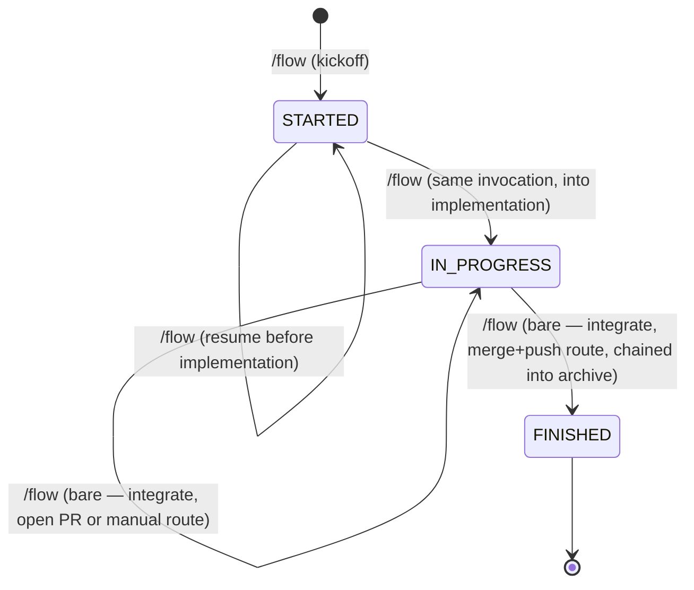

# agents-data

Portable, project-agnostic agent configuration — the **flow** pipeline (spectre +
Superpowers), its skills, slash commands, and always-on rules.
Contains the rule set, an index of the skills, and installation instructions for every
supported AI harness.

**This repository is the source of truth.** Edit the files here, then run
`./setup.sh global` to publish them to every harness. Nothing is ever synced *into*
this repo from a project checkout.

---

## What's in here

```
agents-data/
├── README.md                          ← this file
├── CLAUDE.md                          ← drop into project root for Claude Code
├── AGENTS.md                          ← drop into project root for Codex / OpenAI CLI
├── setup.sh                           ← installer: `global` (recommended) or per-project harness installs
├── rules/
│   ├── flow-manual-review.mdc       ← flow trigger + contract pointers (always-on stub, installed globally)
│   ├── lint-fix-priority.mdc          ← never suppress/bypass linters (always-on, installed globally)
│   ├── never-touch-production.mdc     ← no route to a production system, ever (always-on)
│   ├── be-brief.mdc                   ← answer at the length the question needs; prose only (always-on)
│   ├── build-the-simplest-thing.mdc   ← complexity is opt-in (always-on)
│   ├── dependency-versions.mdc        ← look up the current stable version before adding one (always-on)
│   ├── design-mockups-are-specs.mdc   ← build a mockup exactly as drawn (always-on)
│   ├── context7.mdc                   ← fetch library docs through Context7, not from memory (always-on)
│   ├── dispatch-carries-the-baseline.mdc  ← every subagent dispatch carries the agent-baseline pointer (always-on)
│   ├── agent-baseline.md              ← NOT a rule: the file a dispatched subagent is told to read, listing every rule above and pointing at its installed full text
│   └── kotlin-backend-development-standard.mdc  ← opt-in: named in a project's `.flow/project.md`, rendered into that project's CLAUDE.md + AGENTS.md
├── hooks/
│   └── enforce-agent-baseline.py      ← PreToolUse hook: denies a subagent dispatch whose prompt omits the agent-baseline pointer
├── scripts/
│   ├── check-vocabulary.sh            ← guards the pipeline vocabulary used across these files
│   └── test-setup.sh                  ← regression harness for setup.sh (sandboxed HOME under /tmp)
├── commands/                          ← Cursor slash commands (/flow, /flow-status, /flow-plan, /flow-settings, /flow-self-review)
├── commands-claude/                   ← Claude Code slash commands (the same five)
├── skills/                            ← spectre / /flow skills
│   ├── README.md                      ← flow command map
│   ├── flow/                          ← /flow — brainstorm, implement behind the review panel, integrate and archive, one command
│   ├── flow-status/                   ← read-only state report for open changes
│   ├── flow-plan/                 ← /flow-plan — thinking-partner mode, stages research notes, touches no state
│   ├── flow-settings/                 ← /flow-settings — global model/reviewer defaults
│   ├── flow-self-review/              ← /flow-self-review — run a deferred self-review pass, inline
│   └── flow-contracts/                ← on-demand contracts; pipeline.md is canonical for the state machine
└── spectre/                           ← this repository's own artifact tree: specs/ and changes/
```

**Rules** — whether a rule is always-on is a property of the rule itself, declared once in
its own frontmatter. The tree above is an illustrative
snapshot of today's set, not the definition; read the frontmatter to be sure.

**Skills** (loaded on demand): `/flow` — the single-command pipeline — plus the read-only
`/flow-status`, `/flow-plan` for thinking-partner mode, `/flow-settings` for global
model/reviewer defaults, and `/flow-self-review` for a deferred self-review pass.

**flow pipeline — three states.**

`/flow` drives the full pipeline as one command. Each phase ends in the state named after it, and
**the human gate is a property of the state** — which is why no command exists whose only job is
to record that a review happened. Every invocation is re-entrant, and a fix never moves the state.

`/flow` ends a creating or fix run at `IN_PROGRESS` with both the staged diff and the run
instructions, so reviewing and testing are one sitting. Once `IN_PROGRESS`, a bare invocation asks
how the branch should land — open a PR by default, merge and push, or leave it to you — and stops
there unless merge-and-push was chosen, in which case the same invocation continues straight into
archive once the merge lands: sync and commit onto a `chore/archive-<name>` branch, remove the
worktrees, and — after self-review — push that branch and open its pull request. **Archive never
pushes the base branch**; the merge-and-push route still does, when you choose it. It runs **no**
tests, linters or coverage check — that happened during implementation.

See **How the pipeline works** (`README.md`) below for the state diagram and the per-command stage table, plus `rules/flow-manual-review.mdc` (the always-on stub that points at the pipeline) and `skills/README.md`.

---

## How the pipeline works



### Level 1 — the stages of each command

Two tables. The first is the stage vocabulary itself — every documented stage, across the
commands this pipeline has (`/flow`, `/flow-fast`, and the read-only/no-state commands, exactly
as **Command surface** (`skills/flow-contracts/pipeline.md`) names them). The second is the human
gate that *follows* each command's run — a property of the state the command ends in, never a stage
of its own, so it is kept out of the first table rather than repeated per stage.

**Stages, in order.** One row per stage: a stable **key** a mark carries and the store groups by, a
human-readable **name** that may be reworded without splitting recorded history, and every command
that runs it. A name marked ▸ hides substructure and is expanded at level 2 below.

Every row below is defined by `/flow`, and `/flow-fast` — the one other command that runs rows —
marks every one of them too (`skills/flow-fast/SKILL.md`), most as an empty begin/end pair.
`/flow-status` marks no stages at all and contributes no rows; `/flow-plan` marks the single `plan.session` stage, recorded against the Jira key until `/flow` creates the change. Which phase file under
`skills/flow/` marks each `flow.*` key is **Stage keys** (`skills/flow/SKILL.md`), cited rather
than repeated as a column here.

| Key | Name | Commands |
|-----|------|----------|
| `flow.kickoff` | Kickoff — write `STARTED` | `/flow`, `/flow-fast` |
| `flow.brainstorm` | Brainstorm ▸ | `/flow`, `/flow-fast` |
| `flow.design-approval` | Design approval | `/flow` |
| `flow.create-artifacts` | Create the spectre artifacts | `/flow`, `/flow-fast` |
| `flow.writing-plans` | Writing-plans ▸ | `/flow`, `/flow-fast` |
| `flow.decide` | Decide — execution, models, panel | `/flow`, `/flow-fast` |
| `flow.load-context` | Load context and validate the plan | `/flow`, `/flow-fast` |
| `flow.isolate-workspace` | Isolate the workspace (first run only) | `/flow`, `/flow-fast` |
| `flow.document-fix` | Document the fix (re-runs only) | `/flow`, `/flow-fast` |
| `flow.sdd-tdd` | SDD + TDD per task ▸ | `/flow`, `/flow-fast` |
| `flow.review-panel` | The review panel ▸ | `/flow`, `/flow-fast` |
| `flow.verify` | Verify: workspace isolation, lint and test | `/flow`, `/flow-fast` |
| `flow.visual-verify` | Visual verification | `/flow` |
| `flow.stage-diff` | Stage, excluding the planning paths | `/flow`, `/flow-fast` |
| `flow.run-instructions` | Resolve the run instructions | `/flow`, `/flow-fast` |
| `flow.write-in-progress` | Write `IN_PROGRESS` | `/flow`, `/flow-fast` |
| `flow.preflight` | Preflight verdict (decides run 1 vs run 2) ▸ | `/flow`, `/flow-fast` |
| `flow.unfinished-work-gate` | Unfinished-work gate (run 1) ▸ | `/flow`, `/flow-fast` |
| `flow.landing-question` | The landing question (run 1) | `/flow`, `/flow-fast` |
| `flow.preserve-sessions` | Preserve the session records (run 1) | `/flow`, `/flow-fast` |
| `flow.commit-two` | Two commits, implementation first (run 1) | `/flow`, `/flow-fast` |
| `flow.landing-routes` | The landing routes, including moving the issue to In Review (run 1) ▸ | `/flow`, `/flow-fast` |
| `flow.verify-merge` | Verify the merge (run 2) | `/flow`, `/flow-fast` |
| `flow.sync-archive` | Position the checkout and archive (run 2) | `/flow`, `/flow-fast` |
| `flow.commit-archive` | Commit the archive (run 2) | `/flow`, `/flow-fast` |
| `flow.cleanup` | Cleanup (run 2) ▸ | `/flow`, `/flow-fast` |
| `flow.verify-cleanup` | Verify the cleanup (run 2) | `/flow` |
| `flow.write-finished` | Write `FINISHED` (run 2) | `/flow`, `/flow-fast` |
| `flow.self-review` | Self-review (run 2) | `/flow` |
| `flow.push-archive` | Push the archive branch and open its PR (run 2) | `/flow`, `/flow-fast` |
| `plan.session` | Plan session — the whole `/flow-plan` invocation | `/flow-plan` |

**Gate after it.** `/flow` is one command with several runs — creating, resuming, fix, integrate,
archive — so its row states the gate for each.

| Command | Gate after it |
|---------|---------------|
| `/flow` | creating run or fix: you review the staged diff **and** run the apps; integrate with open PR or manual: you wait for the branch to merge (or finish your manual steps); integrate with merge-and-push, chained into archive: nothing — the state is terminal |
| `/flow-status` | — |
| `/flow-plan` | — |

`/flow`'s run-2 sequence ends with `flow.push-archive`. The row before it, `flow.self-review`,
carries no ▸ either: its procedure is not expanded at level 2 below because it is canonical under
**Run 2 — the branch is merged** (`skills/flow-contracts/finish-contract-run2.md`), step 9 — which is
also the file to change when that procedure changes.

### Level 2 — the stages that hide substructure

Each expansion below states the **structure** — the shape that changes only when the pipeline
changes — and cites the file that owns any tuned threshold rather than restating it: a threshold
copied here is a copy that can go wrong silently the next time the owning file changes.

#### Brainstorm — `/flow`

superpowers:brainstorming runs its checklist in full and ends with the operator approving the
design, which is a hard gate: nothing is created under `spectre/changes/` until that approval
lands. The approved design is saved under the worktree's gitignored `.superpowers/sdd/` and
becomes the source for the change's `design.md` artifact — adapted, never duplicated into a
conflicting second design. Before the checklist opens, the stage checks `docs/research/`
for a staged note matching this topic (per `/flow-plan`'s staging behaviour below) and, if found,
seeds the round from it without ever skipping straight to artifact-writing (design.md's
`flow-plan-staging`).

The stage iterates rather than passing once. After every planning-stage exchange — a round of
clarifying questions, the approval of a design section, the operator's review of the written spec —
one convergence test asks whether the command now holds a question its inputs do not answer, and
while it does, another round opens or is offered. The stage closes only the way any pipeline stage
does — **Stage exit — never the command's own judgment** (`skills/flow-contracts/pipeline.md`).
The threshold, the two prompts, the bounded exception, and why their opposite recommendations are
both honest are **Convergence** (`skills/flow/brainstorm-planner.md`).

No planning-effort, model, or review-panel-roster question runs on a creating run (design.md's
`ask-options-removed`). The roster is resolved from the settings store instead of asked; see
**The review panel** below.

#### Writing-plans — `/flow`

superpowers:writing-plans enriches `tasks.md` from a checkbox scaffold into a plan whose every item
carries exact paths, verification commands and no placeholders — the unit the implement phase
dispatches one implementer against. Its self-review — spec coverage, placeholder scan, type
consistency — runs before the stage finishes.

Every fenced block and every numeric claim in a planning artifact carries a provenance tag,
`verified:<how>` or `unverified:`, which `scripts/check-plan-provenance.sh` makes mechanical rather
than a habit. An unverifiable snippet is tagged and **kept**: a plan without the snippet is worse
than a plan carrying a labelled guess.

`/flow` publishes no proposal artifact (design.md's `publish-proposal-removed`), so a revision
round re-enters at this stage without republishing anything.

#### SDD + TDD per task — `/flow`

One implementer dispatch per checkbox in `tasks.md`, or per tightly coupled group, in plan order.
Every dispatch carries the same required blocks — the commit-per-task boundary,
superpowers:test-driven-development as a required sub-skill, `engineering-principles.md` as required
reading, and the plan-provenance rule above — and names its model explicitly rather than inheriting
the parent's. Each task lands as its own commit on the change branch, guarded by
`scripts/check-task-commit-fields.sh` and pushed as it lands; a blocked task pauses and reports
rather than guessing.

Which model a dispatch runs on is **Model resolution** in `skills/flow/SKILL.md` — one default for
implementer, panel, and panel-fix roles, read from the settings store rather than asked per change
(design.md's `model-default-sonnet`, `settings-scope`); the per-harness enforcement notes in
**Model policy** (`skills/flow-contracts/model-policy.md`) still apply.

#### The review panel — `/flow`

Every run dispatches the roster `skills/flow/SKILL.md`'s **Model resolution** resolves from the
settings store's `.reviewers` list — floored at `primary` alone when the store answers empty,
falling back to three defaults when the store is unreachable (design.md's `roster-from-settings`)
— no preset, no diff-size or touched-area trigger. A per-run operator instruction can still add a
slot the resolved list does not carry, for that run only, checked at the start of the panel stage
and again at every fix round. Each dispatched slot is briefed by its own prompt, in every affected
worktree; slots may share a dispatch — at most two dispatches per round, each carrying one to three
roles (**Bundled dispatch**, `skills/flow/review-panel.md`). The id-to-slot mapping is canonical
under **The roster** (`skills/flow/review-panel.md`); the conditions that force a full re-run in
place of a targeted one are **Panel re-runs** in the same file.

Every slot runs on `DEFAULT_MODEL` — the settings-store default, this run's session-instruction
override, or the decision's own model/effort for the slot on a dynamic roster. Bugbot and Security
are prompt-driven roles like every other slot and take the same model rule — no fixed agent
definition, no override exception. There is no parent-model inheritance and no economy tier: the
panel's cost does not depend on the model the operator happens to be running.

No handoff happens while any finding is open, at any severity — a minor finding blocks exactly as a
critical one does. A fix round re-checks for an explicit Bugbot/Security instruction before it
dispatches; when a finding survives its last fix round the run hands back to the operator, one
finding at a time, with named options.

#### The preflight verdict — `/flow` integrate

`scripts/check-finish-preflight.sh` decides which run happens, from three signals in a fixed order,
taken once per worktree in the resolved set — never a raw read of the state file's `worktrees` map,
per **Resolving a change's worktrees** (`skills/flow-contracts/worktree-resolution.md`). It prints exactly
one verdict line and exits 0 whenever it reached a verdict; a missing verdict line is not a verdict,
and neither is a worktree it cannot read. `RUN1` integrates, `RUN2` archives, and `REFUSE` stops the
run and asks the operator rather than guessing. Run 2 proceeds only when every worktree in the
resolved set returns `RUN2` — and a resolved set that comes back empty is never read as that,
per the same section.

The three signals and why their order is load-bearing are **Finish contract**
(`skills/flow-contracts/finish-contract-run1.md`).

#### The unfinished-work gate — `/flow` integrate, run 1

Runs **before** the landing question and before any git action, once per worktree in the resolved
set — see **Resolving a change's worktrees** (`skills/flow-contracts/worktree-resolution.md`).
`scripts/check-unfinished-work.sh` returns `CLEAR` — go straight to the question, with no extra
prompt — or `OUTSTANDING`, which shows the breakdown and offers **exactly three** courses, with
**Stop** marked as the recommendation. There is no fourth course, and none that hands back to the
implement phase inline.

The ordering is the point: an operator asked how to land a branch, and only then told it carries
unfinished work, has already answered a question about a branch they believed was complete. What
was integrated over is written into the planning commit's message and into the handoff, so the
record outlives the session.

Each course and what run 1 then does are **Run 1 — the branch is not merged**
(`skills/flow-contracts/finish-contract-run1.md`).

#### The landing routes — `/flow` integrate, run 1

The operator is asked once, before any git action, how the branch should land: open a pull request
*(default)*, merge and push, or handle it manually. The run then completes without asking again,
and the answer is never remembered between runs.

All three routes first commit in **two** commits — implementation first, planning artifacts
second; the session records stay in the gitignored worktree and the store. Moving the linked issue to In Review is an unconditional sub-step of
this stage on every route, including the manual one (design.md's `move-in-review-fold`).

The route table is **Run 1 — the branch is not merged**
(`skills/flow-contracts/finish-contract-run1.md`); the guarded two-commit chain every route uses is
**Git boundaries** (`skills/flow-contracts/git-boundaries.md`).

#### Cleanup — `/flow` archive, run 2

Every removal is *remove-or-move if present*, which is what makes run 2 re-entrant: a step whose
artifact is already gone is a success rather than an error, so a re-run after the operator clears a
leftover repeats the verification and nothing else.

The removals are verified rather than assumed. `scripts/check-cleanup-complete.sh` runs once per
repository, **after** all of them: `COMPLETE:` allows the `FINISHED` write, `LEFTOVER:` names what
remains and leaves the change at `IN_PROGRESS`, and a non-zero exit carrying no verdict line is
treated exactly as `LEFTOVER`.

What is removed, when, and on what condition is **Temporary artifacts registry**
(`skills/flow-contracts/artifacts-registry.md`) — the one place a cleanup rule is stated. The procedure for
the rows it removes is **Worktree cleanup** (`skills/flow-contracts/finish-contract-run2.md`).

---

## Installation

### Global install (recommended)

One install, every project. Run it once from this repo:

```bash
cd /path/to/agents-data
./setup.sh global
```

It symlinks straight out of this checkout, so editing a file here takes effect
immediately — no re-run needed except when a file is **added** or **removed**.

**One exception, and it is the highest-stakes one:** what the managed blocks in
`~/.claude/CLAUDE.md`, `~/.codex/AGENTS.md` and `~/.zcode/AGENTS.md` carry is **rendered
text, not a symlink**. Editing an always-on rule has no effect on any harness's injected
prompt until you re-run `./setup.sh global`. The `~/.cursor/rules/`, `~/.claude/rules/`
and `~/.zcode/rules/` copies are live symlinks and need no re-run.

| Target | What lands there |
|--------|------------------|
| `~/.claude/skills/` | every directory in `skills/` (one symlink per skill) |
| `~/.cursor/skills/` | every directory in `skills/`; Cursor resolves `/flow*` commands through these |
| `~/.claude/commands/` | every file in `commands-claude/` — the `/flow*` Claude Code commands |
| `~/.cursor/commands/` | every file in `commands/` — the `/flow*` Cursor commands |
| `~/.zcode/skills/` | every directory in `skills/` — ZCode's user-scope skill location |
| `~/.zcode/commands/` | every file in `commands-claude/` — ZCode reads the same command format Claude Code does |
| `~/.cursor/rules/` | whichever rules declare `alwaysApply: true` in their frontmatter, and only those |
| `~/.claude/rules/` | the same always-on rules, symlinked as `<name>.md` — their **full text**, which the managed block's `Full rule:` pointers name. Plus `agent-baseline.md`, the file a dispatched subagent is told to read |
| `~/.zcode/rules/` | the same full-text links as `~/.claude/rules/`, plus a **generated** `agent-baseline.md`: same source, with its `~/.claude/` pointers rewritten to `~/.zcode/`, so a ZCode-dispatched subagent never depends on another harness's install |
| `~/.claude/hooks/` | every file in `hooks/`. Installed, never registered: `settings.json` is yours, so the installer prints the snippet and leaves the paste to you |
| `~/.zcode/hooks/` | every file in `hooks/`, same deal — registration lives in `~/.zcode/cli/config.json` under `hooks.events`, behind `hooks.enabled: true`, and the installer prints that snippet rather than editing the JSON |
| `~/.claude/CLAUDE.md` | a managed block, delimited by `<!-- flow:begin -->` / `<!-- flow:end -->`, containing each always-on rule's **core** and a pointer to its full text — Claude Code's global rule layer |
| `~/.codex/AGENTS.md` | the **same** managed block, same delimiters, same rendered text — Codex's global rule layer. A global install writes this file even if you never ran a Codex-specific install |
| `~/.zcode/AGENTS.md` | the same managed block with every `~/.claude/` pointer rewritten to its `~/.zcode/` counterpart — ZCode's global rule layer, self-contained |
| `~/.zshrc` (and `~/.bashrc` when it exists) | a small managed block exporting `Z_COMPACT_WINDOW=500000` — the auto-compact window the `/usr/local/bin/zcode` wrapper (Claude Code over the z.ai key) runs with. The wrapper otherwise defaults to the full 1M context, which is how one long session re-bills its whole history on every request. An unmanaged `export Z_COMPACT_WINDOW=` line you wrote yourself wins and is left untouched |

Both the `skills/` and `commands*/` install steps discover their targets by walking the tree —
`skills/*/` and `commands*/*.md` — rather than from a fixed list, so a new skill or command
directory (like `flow/`, `flow-status/`, `flow-plan/`, `flow-settings/`, `flow-self-review/`) is installed the next
time you run `./setup.sh global` with no change to `setup.sh` itself.

### Core and full text are one source

A rule may wrap part of its body in `<!-- core -->` / `<!-- /core -->`. Globally, the
managed block gets that core plus `Full rule: ~/.claude/rules/<name>.md`, and the pointer
resolves to a symlink back to the very `.mdc` the core was rendered from — one file, no
second copy to go stale. A rule with no markers is inlined whole, exactly as before.

Core extraction is global-only. A project's opted-in standards render into that project's
own `CLAUDE.md` with the full body and no pointer, because `~/.claude/rules/` never holds
an opt-in rule. The markers themselves are stripped from every render.

Subagents inherit none of this. A dispatched agent reads no `CLAUDE.md`, so every dispatch
has to carry a pointer to `~/.claude/rules/agent-baseline.md` — which lists every rule in a
line, points at these same paths, and instructs the agent to pass the same pointer on, so
the rules survive to any dispatch depth. `hooks/enforce-agent-baseline.py` denies a
dispatch whose prompt omits it.

Two things are deliberate:

- **Opt-in rules are excluded from everything on this page.** A rule that does not declare
  `alwaysApply: true` is never installed globally — not into `~/.cursor/rules/`, not into
  either managed block. The Kotlin backend standard is one: it applies to Kotlin backends,
  not to every project on the machine. Such a rule reaches a project only through that
  project's own `.flow/project.md`, and only a **per-project** install renders it — see
  [Opt-in rules land in the project](#opt-in-rules-land-in-the-project) below.
- **The managed blocks are inlined, not referenced — in `~/.claude/CLAUDE.md` *and*
  `~/.codex/AGENTS.md`.** Neither Claude Code nor Codex reads `~/.cursor/rules/`, so for
  both harnesses the managed block is the only global rule layer. The two blocks are
  written by the same installer function with identical content. In each file, only the
  text between the delimiters is rewritten on re-install; your own notes outside them are
  never touched. If both delimiters are absent, a fresh block is appended. If they are
  present but not exactly one begin above one end, the installer stops and reports the
  offending line numbers rather than risk deleting content.

Per-project installs (`cursor`, `claude-code`, `codex`, `zcode`, `all`) below remain available
for projects that need a checked-in, project-local copy — and are the **only** way an opt-in
rule reaches a project. Prefer `global` for everything else.

---

## Opt-in rules land in the project

An opt-in rule is installed nowhere by path, deliberately: the Kotlin backend standard's
globs (`src/**/*.kt`, `**/*.kts`) would otherwise match every Compose Multiplatform or
IDE-plugin repo on the machine. But a rule installed nowhere is a rule no session ever
reads, which is why projects used to keep a pasted copy of the standard in their own
`CLAUDE.md` *and* `AGENTS.md` — two copies with nothing keeping either in step with the
rule they came from.

Every **per-project** install (`cursor`, `claude-code`, `codex`, `all`) closes that gap:

1. It reads `<project>/.flow/project.md` and takes the `## standards` section. No file, or
   no such section, and it does nothing at all — silently.
2. It keeps the entries that resolve to the shared rule library: a **bare filename ending in
   `.mdc`** (`kotlin-backend-development-standard.mdc` → `<agents repo>/rules/<name>`). An
   entry containing a `/` is a project path, and any other bare filename is the project's own
   file — neither is a shared rule. See the resolution table in
   `skills/flow-contracts/project-configuration.md`, which is canonical.
3. It drops any rule that is already `alwaysApply: true` — that one arrives through the
   global block, and rendering it again is the duplication this exists to remove.
4. It renders what remains into a managed block — same `<!-- flow:begin -->` /
   `<!-- flow:end -->` delimiters, same frontmatter stripping, same `.flow.bak` and
   delimiter guards as the global block — in **both** `<project>/CLAUDE.md` and
   `<project>/AGENTS.md`.
5. An entry naming a rule that does not exist is reported by name and skipped. The rest of
   the install completes; the exit status still reports the skip.

`global` never does this: it installs no project files, and must not start writing into
whatever directory it was run from.

Only the text between the delimiters is rewritten, so your own notes around it survive. The
rendered block is generated content — edit `rules/<name>.mdc` in this repo and re-run the
per-project install; a hand-edit inside the delimiters is overwritten on the next run.

---

## Per-project installation per harness

### Cursor

Cursor reads rules from `.cursor/rules/` and skills from `.cursor/skills/`.
A global install already covers commands and always-on rules; use a project-local
install only when the project needs its own checked-in copy. It carries **skills and
commands only** — plus the same always-on rules, since `alwaysApply` is decided by the
rule, not by the install path. It additionally renders the project's **opt-in** rules into
the managed block in its `CLAUDE.md` and `AGENTS.md`; no install path ever places an opt-in
rule as a file. See [Opt-in rules land in the project](#opt-in-rules-land-in-the-project).

To install into a Cursor project, run:

```bash
cd /path/to/other-project
./path/to/agents-data/setup.sh cursor
```

This symlinks `agents-data/skills/` into `.cursor/skills/`, the always-on rules from `agents-data/rules/` into `.cursor/rules/`, and `agents-data/commands/` into `.cursor/commands/`.

---

### Claude Code

Claude Code reads `CLAUDE.md` from the project root and discovers skills from
`.claude/skills/` (when Superpowers is installed).

**Step 1 — Install Superpowers** (general workflow skills: brainstorming, TDD, etc.)

In a Claude Code session inside the project:
```
/plugin install prime-radiant-inc/superpowers
```

**Step 2 — Add project instructions**

```bash
cp /path/to/agents-data/CLAUDE.md /path/to/project/CLAUDE.md
```

**Step 3 — Add project-specific skills and slash commands**

```bash
cd /path/to/project
./path/to/agents-data/setup.sh claude-code
# or manually:
mkdir -p .claude/skills .claude/commands
for d in /path/to/agents-data/skills/*/; do
  ln -sf "$d" .claude/skills/
done
for f in /path/to/agents-data/commands-claude/*.md; do
  ln -sf "$f" .claude/commands/
done
```

Step 3 also renders any opt-in rule the project named in its `.flow/project.md` into the
managed block in `CLAUDE.md` (and `AGENTS.md`), so run it **after** step 2 — the block goes
into the file step 2 put there.

Without `.claude/commands/`, `/flow` typed in the CLI will fail with "Unknown
command" — Claude Code only auto-discovers skills by their `SKILL.md` `name:` (e.g. `flow`),
not by the slash-command alias. The `commands-claude/*.md` files are thin wrappers that map the
command name to the underlying skill.

**Verify**: In a new Claude Code session, ask: *"What project skills do you have?"*
The agent should be able to list and describe the `flow`/`flow-status`/`flow-plan`/
`flow-settings`/`flow-self-review` skills, and typing `/flow` should resolve without an "Unknown
command" error.

---

### Codex (OpenAI)

Codex reads `AGENTS.md` from the project root and `~/.codex/AGENTS.md` globally, and
discovers skills natively when the Superpowers Codex plugin is installed. It reads neither
`~/.claude/CLAUDE.md` nor `~/.cursor/rules/`.

**`setup.sh global` writes `~/.codex/AGENTS.md`.** It inserts the same managed block it
writes into `~/.claude/CLAUDE.md` — the always-on rule text, between
`<!-- flow:begin -->` / `<!-- flow:end -->` — because that block is Codex's only global
rule layer. This happens on every `global` install, whether or not you also run a
Codex-specific install; your own content outside the delimiters is left alone.

**Step 1 — Install Superpowers for Codex**

The Superpowers Codex plugin is distributed from a separate fork repo.
Install it per the Superpowers README (look for the Codex install section).

Enable multi-agent support:
```toml
# ~/.codex/config.toml
[features]
multi_agent = true
```

**Step 2 — Add project instructions**

```bash
cp /path/to/agents-data/AGENTS.md /path/to/project/AGENTS.md
```

**Step 3 — Add project-specific skills**

```bash
cd /path/to/project
./path/to/agents-data/setup.sh codex
# or manually:
mkdir -p .codex/skills
for d in /path/to/agents-data/skills/*/; do
  ln -sf "$d" .codex/skills/
done
```

The `setup.sh codex` form (unlike the manual loop) also renders any opt-in rule the project
named in its `.flow/project.md` into the managed block in `AGENTS.md` and `CLAUDE.md`.
Run it **after** step 2.

**Model note:** Codex has no per-skill/per-command model override mechanism — model is a session or profile-level setting (`~/.codex/config.toml`). Switch to a stronger model manually before invoking `flow` (the `/flow` equivalent) on a creating run; the rest of the pipeline is fine on your default.

---

### ZCode

ZCode reads `AGENTS.md` from the project root and `~/.zcode/AGENTS.md` as its user default
instructions, and discovers skills and `.md` slash commands from `~/.zcode/skills/` and
`~/.zcode/commands/` at user scope (plus `.zcode/` variants at workspace scope). It reads
neither `~/.claude/` nor `~/.cursor/` nor `~/.codex/` — every ZCode path below lives under
`~/.zcode/`, so this harness's install cannot affect any other harness's setup, and no
other harness's install is a dependency of it.

**`setup.sh global` writes `~/.zcode/AGENTS.md`.** It inserts the same managed block the
other harnesses get, with one deliberate difference: every `~/.claude/` pointer inside the
block is rewritten to its `~/.zcode/` counterpart, because that is where the ZCode install
put the full-text rule links, the generated `agent-baseline.md`, and the hook.

**Step 1 — Install Superpowers for ZCode**

ZCode has no Superpowers plugin channel; Superpowers is a plain set of skills, so copy
them once:

```bash
cp -R /path/to/superpowers/skills/* ~/.zcode/skills/
```

(On a machine with Claude Code's plugin cache, the source is
`~/.claude/plugins/cache/claude-plugins-official/superpowers/<version>/skills/`.)

**Step 2 — Register the agent-baseline hook** (the installer prints this snippet and
leaves the paste to you — the JSON config is yours):

```jsonc
// ~/.zcode/cli/config.json
{
  "hooks": {
    "enabled": true,
    "events": {
      "PreToolUse": [
        { "matcher": "Agent|Task", "hooks": [
          { "type": "command", "command": "python3 \"$HOME/.zcode/hooks/enforce-agent-baseline.py\"" }
        ] }
      ]
    }
  }
}
```

**Step 3 — Per-project install**, when a project wants its own checked-in copies (also the
only path that renders the project's opt-in standards into its `AGENTS.md`):

```bash
cd /path/to/project
./path/to/agents-data/setup.sh zcode
```

This links skills into `.zcode/skills/`, commands into `.zcode/commands/`, and copies
`AGENTS.md` to the project root if it is not there already.

**Model note:** like Codex, ZCode resolves the model at the session level; the `model:`
frontmatter in the `/flow*` command files is ignored. Pick the session's model before a
creating run.

---

### Gemini CLI

Gemini reads `GEMINI.md` from the project root and discovers skills via its extension
manifest's `contextFileName`.

**Step 1 — Install Superpowers for Gemini**

```bash
gemini extensions install prime-radiant-inc/superpowers
```

**Step 2 — Create GEMINI.md** with the rules inlined (same content as CLAUDE.md).

**Step 3 — Skills**: Gemini's Superpowers extension auto-discovers skills in its bundle.
For project-specific skills, symlink into `.gemini/skills/` if that path is recognized,
or inline the skill content into `GEMINI.md`.

---

## How skills work (no Superpowers installed)

If Superpowers is **not** installed, the agent can still use the project skills
by reading the `SKILL.md` file directly:

```
Read file: .claude/skills/flow/SKILL.md
(follow the instructions in that file)
```

The `flow` skill (and the retiring `flow-*` skills) internally reference Superpowers skills
(brainstorming, TDD, etc.). Without Superpowers those general skills won't auto-trigger, so the
overall workflow is degraded but the spectre-specific steps still work.

---

## /flow commands reference

`<name>` is **optional** on every command below — if omitted, the sole active (non-archived) change relevant to that state is used automatically; if there are multiple, you're asked which.

**No command takes a flag.** The only argument is the change name; anything else is reported rather than ignored.

**Model:** `/flow` reads its model from `skills/flow/SKILL.md`'s own **Model resolution**; see "Model policy" in `skills/flow-contracts/model-policy.md` for the per-harness enforcement notes that still apply.

| Command | Skill | What it does |
|---------|-------|-------------|
| `/flow <name>` | `flow` | Single-command pipeline. No state: creates the change, writes `STARTED`, and — same invocation — runs brainstorming (unchanged, fully interactive) then implementation behind the review panel resolved from the settings store, ending at `IN_PROGRESS`. Asks no planning-effort, model, or review-panel-roster question and publishes no proposal artifact. `IN_PROGRESS` with an argument: fix run, state unchanged. `IN_PROGRESS` bare: asks how to land the branch — open PR (default), merge and push, or manual — then, on merge-and-push, continues in the same invocation through archive to `FINISHED`; open PR and manual stop and hand off. Runs no tests, linters or coverage check outside implementation's own verify stage. |
| *(gate)* | You | Creating run or fix: review the staged diff **and** run the apps. Integrate with open PR or manual: wait for the branch to merge (or finish your manual steps). Merge-and-push: nothing — the state is terminal. |
| `/flow-status [name]` | `flow-status` | Read-only state report for open changes |
| `/flow-plan` | `flow-plan` | Thinking-partner mode — no implementation, no state; stages research notes under `docs/research/` for `/flow`'s brainstorming to seed from |
| `/flow-settings` | `flow-settings` | Reads/writes the global model and reviewer defaults every `/flow` run reads from |
| `/flow-self-review <name>` | `flow-self-review` | Runs a self-review pass a `/flow` run deferred, inline on this session's model, from the saved context bundle |

Each row above says what a command is *for*. Its stages, in order — and the human gate that follows
each — are stated once under
**Level 1 — the stages of each command** (`README.md`) above and are deliberately not repeated
here — one ordered list rather than two competing ones in the same file.

The branch's merge status alone decides which run `/flow`'s integrate/archive phase performs, so a
PR you merged on the forge and a merge it performed itself are indistinguishable to it — which is
correct.

Every skill above but `flow-plan` requires the `spectre` CLI
(`go install github.com/tweety53/spectre/cmd/spectre@latest`, with `$(go env GOPATH)/bin` on your
`PATH`). `flow-plan` needs none — reading a spectre tree is reading markdown.

## Making a change

**Edit the files here — this repo is the source of truth — then run `./setup.sh global`.**

```bash
cd /path/to/agents-data
$EDITOR skills/flow/SKILL.md   # or any rule / command / skill
./setup.sh global
```

There is no importer, no sync hook, and no rsync from a project checkout. A project's
`.cursor/` or `.claude/` tree is an *install target* fed from here; never edit an
installed copy expecting it to travel back.

**Rules are the exception — every rule's text is copied somewhere, not linked.** Treat every
edit to `rules/*.mdc` as requiring a re-install, and note that the two kinds re-install with
different commands:

| Rule kind | Where its text is copied | Re-install with |
|-----------|--------------------------|-----------------|
| `alwaysApply: true` (`lint-fix-priority`, `flow-manual-review`) | the managed blocks in `~/.claude/CLAUDE.md` and `~/.codex/AGENTS.md` (plus a live symlink in `~/.cursor/rules/`) | `./setup.sh global` |
| opt-in (`kotlin-backend-development-standard`) | the managed block in the `CLAUDE.md` and `AGENTS.md` of **each project that named it** in `.flow/project.md` | `./setup.sh <harness> /path/to/that/project`, once per adopting project |

An opt-in rule edited here therefore changes nothing for any project until that project's
install is re-run — and the projects that adopted it are listed nowhere but in their own
`.flow/project.md` files, so a change to a widely-adopted opt-in rule needs a sweep.

`AGENTS.md` / `CLAUDE.md` carry their own flow summary tables — update those by hand
when the pipeline description changes, and keep every command file in `commands/` and
`commands-claude/` consistent with the skill it points at. A command that contradicts its
skill is a defect, not a shorthand.
