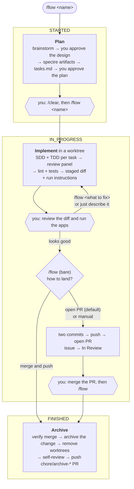

# agents

Portable, project-agnostic agent configuration: the **flow** pipeline (spectre + Superpowers), its
skills and slash commands, always-on rules, hooks, and the stats service that records every run.

**This repository is the source of truth.** Edit files here, then run `./setup.sh global`. Nothing
is ever synced *into* this repo from a project checkout.

---

## Quick start

```bash
./setup.sh global                                          # install into every harness
go install github.com/tweety53/spectre/cmd/spectre@latest  # needed by every skill but /flow-plan
```

Then, in Claude Code, install Superpowers (`/plugin install prime-radiant-inc/superpowers`),
register the hooks the installer prints into `~/.claude/settings.json`, and type `/flow <name>` in
any project.

---

## What's in here

| Path | What it is |
|------|------------|
| `rules/` | Rules. Whether one is always-on is declared by `alwaysApply` in its own frontmatter; opt-in rules (e.g. the Kotlin backend standard) reach only projects that name them. `agent-baseline.md` is not a rule — it is the file every dispatched subagent is told to read |
| `skills/` | The `/flow*` skills; `skills/flow-contracts/` holds the on-demand contracts, with `pipeline.md` canonical for the state machine. Command map: `skills/README.md` |
| `commands/`, `commands-claude/` | Thin slash-command wrappers for Cursor and for Claude Code/ZCode |
| `agents/` | Subagent definitions (`flow-low`, `flow-medium`, `flow-high`, `flow-review`) |
| `hooks/` | `enforce-agent-baseline.py` (denies a dispatch missing the baseline pointer), `protect-main-checkout.py` (denies edits on a main checkout's default branch), `flow-active-change.py` (turns a plain problem report into a fix run) |
| `scripts/` | The guards `/flow` runs, each with its `test-*.sh` harness |
| `stats/` | `flowd` — the PostgreSQL-backed service holding pipeline state and per-stage telemetry, with a web UI. See `stats/README.md` |
| `spectre/` | This repository's own specs and changes |
| `CLAUDE.md`, `AGENTS.md` | This repository's project instructions, and templates for other projects |
| `setup.sh` | The installer |

---

## Commands

`<name>` is optional everywhere: with one open change it is picked automatically, otherwise you are
asked. No command takes a flag.

| Command | What it does |
|---------|--------------|
| `/flow <name>` | The whole pipeline, one command, re-entrant — see below |
| `/flow-fast <name>` | Minimal-ceremony variant: worktree, inline implementation, lint + targeted tests, default landing route, cleanup. No spectre artifacts or review panel |
| `/flow-plan` | Thinking-partner mode, no implementation; a captured session creates the change at `STARTED` |
| `/flow-status [name]` | Read-only report of every open change |
| `/flow-settings` | Global default model and reviewer slots |
| `/flow-self-review <name>` | Runs a self-review pass a run deferred |

## How the pipeline works

Three states. Every arrow into a box is a `/flow` invocation, and every hexagon is a gate that is
yours.



- **The gate is the state.** No command exists just to record that you reviewed something.
- **A fix never moves the state.** Re-run `/flow` with instructions, or describe the problem in the
  same session.
- **Merge status alone decides** whether a bare `/flow` integrates or archives, so a PR merged on
  the forge and one `/flow` merged itself look the same.
- **Archive runs no tests or linters** and never pushes the base branch.

Canonical detail: **State transitions** (`skills/flow-contracts/pipeline.md`), and
`skills/flow-contracts/finish-contract-run1.md` / `finish-contract-run2.md` for landing and archive.

### Level 1 — the stages of each command

Every stage a run marks in `flowd`. `stats/internal/stages/names_test.go` parses this table and
fails if it drifts from the code, so edit both together. `/flow-status` marks nothing; which phase
file marks each key is **Stage keys** (`skills/flow/SKILL.md`).

| Key | Name | Commands |
|-----|------|----------|
| `flow.kickoff` | Kickoff — write `STARTED` | `/flow`, `/flow-fast` |
| `flow.brainstorm` | Brainstorm ▸ | `/flow`, `/flow-fast` |
| `flow.design-approval` | Design approval | `/flow` |
| `flow.create-artifacts` | Create the spectre artifacts | `/flow`, `/flow-fast` |
| `flow.writing-plans` | Writing-plans ▸ | `/flow`, `/flow-fast` |
| `flow.decide` | Decide — execution, models, panel | `/flow`, `/flow-fast` |
| `flow.load-context` | Load context and validate the plan | `/flow`, `/flow-fast` |
| `flow.isolate-workspace` | Isolate the workspace (first run only) | `/flow`, `/flow-fast` |
| `flow.document-fix` | Document the fix (re-runs only) | `/flow`, `/flow-fast` |
| `flow.sdd-tdd` | SDD + TDD per task ▸ | `/flow`, `/flow-fast` |
| `flow.review-panel` | The review panel ▸ | `/flow`, `/flow-fast` |
| `flow.verify` | Verify: workspace isolation, lint and test | `/flow`, `/flow-fast` |
| `flow.visual-verify` | Visual verification | `/flow` |
| `flow.stage-diff` | Stage, excluding the planning paths | `/flow`, `/flow-fast` |
| `flow.run-instructions` | Resolve the run instructions | `/flow`, `/flow-fast` |
| `flow.write-in-progress` | Write `IN_PROGRESS` | `/flow`, `/flow-fast` |
| `flow.preflight` | Preflight verdict (decides run 1 vs run 2) ▸ | `/flow`, `/flow-fast` |
| `flow.unfinished-work-gate` | Unfinished-work gate (run 1) ▸ | `/flow`, `/flow-fast` |
| `flow.landing-question` | The landing question (run 1) | `/flow`, `/flow-fast` |
| `flow.preserve-sessions` | Preserve the session records (run 1) | `/flow`, `/flow-fast` |
| `flow.commit-two` | Two commits, implementation first (run 1) | `/flow`, `/flow-fast` |
| `flow.landing-routes` | The landing routes, including moving the issue to In Review (run 1) ▸ | `/flow`, `/flow-fast` |
| `flow.verify-merge` | Verify the merge (run 2) | `/flow`, `/flow-fast` |
| `flow.sync-archive` | Position the checkout and archive (run 2) | `/flow`, `/flow-fast` |
| `flow.commit-archive` | Commit the archive (run 2) | `/flow`, `/flow-fast` |
| `flow.cleanup` | Cleanup (run 2) ▸ | `/flow`, `/flow-fast` |
| `flow.verify-cleanup` | Verify the cleanup (run 2) | `/flow` |
| `flow.write-finished` | Write `FINISHED` (run 2) | `/flow`, `/flow-fast` |
| `flow.self-review` | Self-review (run 2) | `/flow`, `/flow-fast` |
| `flow.push-archive` | Push the archive branch and open its PR (run 2) | `/flow`, `/flow-fast` |
| `plan.session` | Plan session — the whole `/flow-plan` invocation | `/flow-plan` |

▸ marks a stage with substructure; its procedure lives in the phase file under `skills/flow/`.

---

## Installation

### Global (recommended)

```bash
./setup.sh global
```

Symlinks skills, commands, agents, hooks and full-text rules into `~/.claude/`, `~/.cursor/` and
`~/.zcode/`, and writes a managed block of always-on rules into `~/.claude/CLAUDE.md`,
`~/.codex/AGENTS.md` and `~/.zcode/AGENTS.md`. It also exports `Z_COMPACT_WINDOW` from
`~/.zshrc` (and `~/.bashrc` when present) for the `zcode` wrapper.

- **Edits to existing skills, commands and hooks are live** — they are symlinks. Re-run only when
  a file is added or removed.
- **Edits to an always-on rule need a re-run.** The managed blocks carry rendered text (each rule's
  `<!-- core -->` section plus a `Full rule:` pointer), not a link. Only the text between
  `<!-- flow:begin -->` / `<!-- flow:end -->` is rewritten; your own notes around it survive.
- **Hooks are installed, never registered.** The installer prints the `settings.json` (or ZCode
  `~/.zcode/cli/config.json`) snippet and leaves the paste to you.
- **Subagents read no `CLAUDE.md`,** so every dispatch must point at
  `~/.claude/rules/agent-baseline.md`; `enforce-agent-baseline.py` denies one that does not.

### Per project

```bash
cd /path/to/project
/path/to/agents/setup.sh <cursor|claude-code|codex|zcode|all>
```

Links skills and commands into the project's `.cursor/`, `.claude/`, `.codex/` or `.zcode/`. It is
also the **only** way an opt-in rule reaches a project: it reads the `## standards` section of
`<project>/.flow/project.md`, keeps bare `*.mdc` names from `rules/` that are not already
always-on, and renders them into a managed block in both `<project>/CLAUDE.md` and `AGENTS.md`.
Re-run it in each adopting project after editing an opt-in rule.

### Claude Code

Install Superpowers with `/plugin install prime-radiant-inc/superpowers`. Without the command
wrappers in `commands-claude/`, typing `/flow` fails with "Unknown command" — Claude Code finds
skills by name, not by slash alias.

### Codex

Install the Superpowers Codex plugin per its README, then enable subagents:

```toml
# ~/.codex/config.toml
[features]
multi_agent = true
```

Codex picks the model per session, not per command: switch to a stronger one before a creating
`/flow` run.

### ZCode

ZCode has no Superpowers plugin channel; copy the skills once:

```bash
cp -R ~/.claude/plugins/cache/claude-plugins-official/superpowers/<version>/skills/* ~/.zcode/skills/
```

Everything ZCode uses lives under `~/.zcode/`, with rule pointers rewritten from `~/.claude/`. Like
Codex, it picks the model per session.
