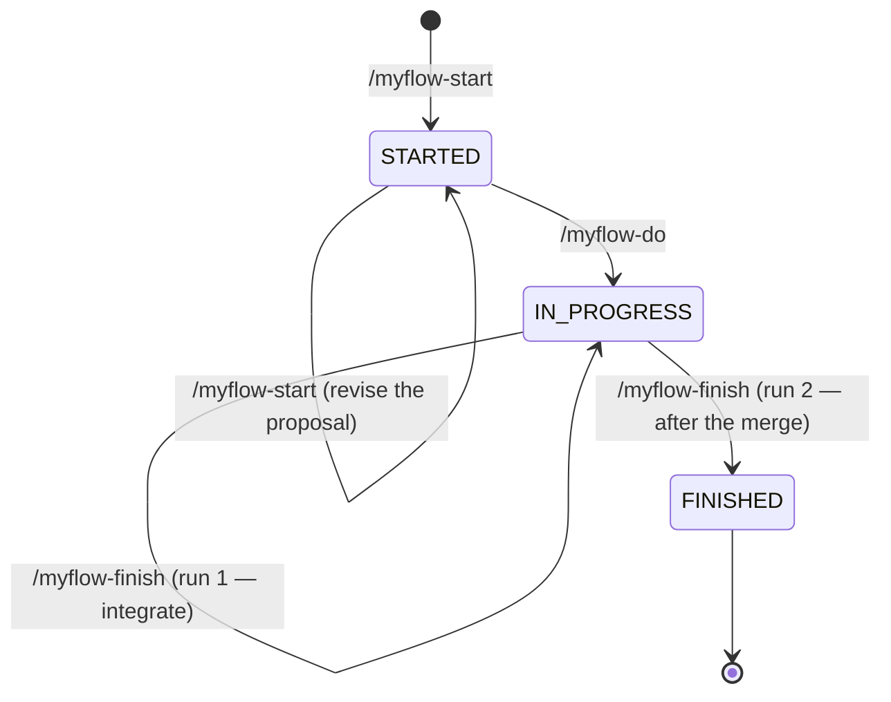

# agents-data

Portable, project-agnostic agent configuration — the **myflow** pipeline (OpenSpec +
Superpowers), its skills, slash commands, and always-on rules.
Contains the rule set, an index of the skills, and installation instructions for every
supported AI harness.

**This repository is the source of truth.** Edit the files here, then run
`./setup.sh global` to publish them to every harness. Nothing is ever synced *into*
this repo from a project checkout.

---

## What's in here

```
agents-data/
├── README.md                          ← this file
├── CLAUDE.md                          ← drop into project root for Claude Code
├── AGENTS.md                          ← drop into project root for Codex / OpenAI CLI
├── setup.sh                           ← installer: `global` (recommended) or per-project harness installs
├── rules/
│   ├── myflow-manual-review.mdc       ← myflow trigger + contract pointers (always-on stub, installed globally)
│   ├── lint-fix-priority.mdc          ← never suppress/bypass linters (always-on, installed globally)
│   └── kotlin-backend-development-standard.mdc  ← opt-in: named in a project's `.myflow/project.md`, rendered into that project's CLAUDE.md + AGENTS.md
├── scripts/
│   ├── check-vocabulary.sh            ← guards the pipeline vocabulary used across these files
│   └── test-setup.sh                  ← regression harness for setup.sh (sandboxed HOME under /tmp)
├── commands/                          ← Cursor slash commands (myflow + opsx:explore)
├── commands-claude/                   ← Claude Code slash commands (myflow only)
└── skills/                            ← OpenSpec / /myflow skills
    ├── README.md                      ← myflow command map
    ├── myflow-start/                  ← /myflow-start
    ├── myflow-do/                     ← /myflow-do; carries the review-panel prompts + engineering-principles.md
    ├── myflow-finish/                 ← /myflow-finish (integrate, then archive + clean up)
    ├── myflow-status/                 ← read-only state report for open changes
    ├── myflow-info/                   ← reads pipeline.md and explains the pipeline
    ├── myflow-contracts/              ← on-demand contracts; pipeline.md is canonical for the state machine
    └── openspec-explore/              ← /opsx:explore — thinking-partner mode, touches no state
```

**Rules** — whether a rule is always-on is a property of the rule itself, declared once in
its own frontmatter. `setup.sh global` installs whichever rules declare `alwaysApply: true`,
and only those. Every other rule is **opt-in**: it is never installed globally, and a project
adopts it by naming it in the `## standards` section of its own `.myflow/project.md`. A
per-project install (`cursor`, `claude-code`, `codex`, `all`) then renders every opt-in rule
that project named into a managed block in **that project's own `CLAUDE.md` and `AGENTS.md`**
— the same delimiters and the same inlining as the global block, so the rule text actually
loads for the harness instead of merely being referenced. The tree above is an illustrative
snapshot of today's set, not the definition; read the frontmatter to be sure.

**Skills** (loaded on demand): `/myflow-start`, `/myflow-do`, `/myflow-finish`, plus the read-only
`/myflow-status` and `/myflow-info`, and `/opsx:explore` for thinking-partner mode.

**myflow pipeline — three states, three commands:**



```text
/myflow-start  → STARTED      you: read the proposal artifact
/myflow-do     → IN_PROGRESS  you: review the staged diff and run the apps
/myflow-finish → FINISHED     terminal (it integrates on its first run)
```

Each command ends in the state named after it, and **the human gate is a property of the state** —
which is why no command exists whose only job is to record that a review happened. `/myflow-do`
emits both the staged diff and the manual test guide, so reviewing and testing are one sitting.
Every command is re-entrant, and a fix never moves the state. **No command takes a flag.**

`/myflow-finish` runs **twice**: once to integrate the branch (open a PR by default, merge and
push, or leave it to you), and again once the branch is merged, to sync delta specs, archive,
commit and push the archive, and remove the worktrees. It runs **no** tests, linters or coverage
check — that happened during `/myflow-do`.

See `skills/myflow-contracts/pipeline.md` (the pipeline itself), `rules/myflow-manual-review.mdc` (the always-on stub that points at it), and `skills/README.md`.

---

## Installation

### Global install (recommended)

One install, every project. Run it once from this repo:

```bash
cd /path/to/agents-data
./setup.sh global
```

It symlinks straight out of this checkout, so editing a file here takes effect
immediately — no re-run needed except when a file is **added** or **removed**.

**One exception, and it is the highest-stakes one:** the always-on rules
(`rules/*.mdc` with `alwaysApply: true`) are *not* symlinked into Claude Code or Codex —
their text is **inlined** into the managed blocks in `~/.claude/CLAUDE.md` and
`~/.codex/AGENTS.md`. Editing `rules/lint-fix-priority.mdc` or
`rules/myflow-manual-review.mdc` has no effect on either harness until you re-run
`./setup.sh global`. Only the `~/.cursor/rules/` copy is a live symlink.

| Target | What lands there |
|--------|------------------|
| `~/.claude/skills/` | every directory in `skills/` (one symlink per skill) |
| `~/.cursor/skills/` | every directory in `skills/`; Cursor resolves `/myflow-*` commands through these |
| `~/.claude/commands/` | every file in `commands-claude/` — the `/myflow-*` Claude Code commands |
| `~/.cursor/commands/` | every file in `commands/` — the `/myflow-*` and `/opsx:*` Cursor commands |
| `~/.cursor/rules/` | whichever rules declare `alwaysApply: true` in their frontmatter, and only those |
| `~/.claude/CLAUDE.md` | a managed block, delimited by `<!-- myflow:begin -->` / `<!-- myflow:end -->`, containing the always-on rule text inlined — Claude Code's global rule layer |
| `~/.codex/AGENTS.md` | the **same** managed block, same delimiters, same inlined rule text — Codex's global rule layer. A global install writes this file even if you never ran a Codex-specific install |

Two things are deliberate:

- **Opt-in rules are excluded from everything on this page.** A rule that does not declare
  `alwaysApply: true` is never installed globally — not into `~/.cursor/rules/`, not into
  either managed block. The Kotlin backend standard is one: it applies to Kotlin backends,
  not to every project on the machine. Such a rule reaches a project only through that
  project's own `.myflow/project.md`, and only a **per-project** install renders it — see
  [Opt-in rules land in the project](#opt-in-rules-land-in-the-project) below.
- **The managed blocks are inlined, not referenced — in `~/.claude/CLAUDE.md` *and*
  `~/.codex/AGENTS.md`.** Neither Claude Code nor Codex reads `~/.cursor/rules/`, so for
  both harnesses the managed block is the only global rule layer. The two blocks are
  written by the same installer function with identical content. In each file, only the
  text between the delimiters is rewritten on re-install; your own notes outside them are
  never touched. If both delimiters are absent, a fresh block is appended. If they are
  present but not exactly one begin above one end, the installer stops and reports the
  offending line numbers rather than risk deleting content.

Per-project installs (`cursor`, `claude-code`, `codex`, `all`) below remain available for
projects that need a checked-in, project-local copy — and are the **only** way an opt-in
rule reaches a project. Prefer `global` for everything else.

---

## Opt-in rules land in the project

An opt-in rule is installed nowhere by path, deliberately: the Kotlin backend standard's
globs (`src/**/*.kt`, `**/*.kts`) would otherwise match every Compose Multiplatform or
IDE-plugin repo on the machine. But a rule installed nowhere is a rule no session ever
reads, which is why projects used to keep a pasted copy of the standard in their own
`CLAUDE.md` *and* `AGENTS.md` — two copies with nothing keeping either in step with the
rule they came from.

Every **per-project** install (`cursor`, `claude-code`, `codex`, `all`) closes that gap:

1. It reads `<project>/.myflow/project.md` and takes the `## standards` section. No file, or
   no such section, and it does nothing at all — silently.
2. It keeps the entries that resolve to the shared rule library: a **bare filename ending in
   `.mdc`** (`kotlin-backend-development-standard.mdc` → `<agents repo>/rules/<name>`). An
   entry containing a `/` is a project path, and any other bare filename is the project's own
   file — neither is a shared rule. See the resolution table in
   `skills/myflow-contracts/project-configuration.md`, which is canonical.
3. It drops any rule that is already `alwaysApply: true` — that one arrives through the
   global block, and rendering it again is the duplication this exists to remove.
4. It renders what remains into a managed block — same `<!-- myflow:begin -->` /
   `<!-- myflow:end -->` delimiters, same frontmatter stripping, same `.myflow.bak` and
   delimiter guards as the global block — in **both** `<project>/CLAUDE.md` and
   `<project>/AGENTS.md`.
5. An entry naming a rule that does not exist is reported by name and skipped. The rest of
   the install completes; the exit status still reports the skip.

`global` never does this: it installs no project files, and must not start writing into
whatever directory it was run from.

Only the text between the delimiters is rewritten, so your own notes around it survive. The
rendered block is generated content — edit `rules/<name>.mdc` in this repo and re-run the
per-project install; a hand-edit inside the delimiters is overwritten on the next run.

---

## Per-project installation per harness

### Cursor

Cursor reads rules from `.cursor/rules/` and skills from `.cursor/skills/`.
A global install already covers commands and always-on rules; use a project-local
install only when the project needs its own checked-in copy. It carries **skills and
commands only** — plus the same always-on rules, since `alwaysApply` is decided by the
rule, not by the install path. It additionally renders the project's **opt-in** rules into
the managed block in its `CLAUDE.md` and `AGENTS.md`; no install path ever places an opt-in
rule as a file. See [Opt-in rules land in the project](#opt-in-rules-land-in-the-project).

To install into a Cursor project, run:

```bash
cd /path/to/other-project
./path/to/agents-data/setup.sh cursor
```

This symlinks `agents-data/skills/` into `.cursor/skills/`, the always-on rules from `agents-data/rules/` into `.cursor/rules/`, and `agents-data/commands/` into `.cursor/commands/`. If the project's `.myflow/project.md` names any opt-in rule, that rule's text is also rendered into the managed block in the project's `CLAUDE.md` and `AGENTS.md`.

---

### Claude Code

Claude Code reads `CLAUDE.md` from the project root and discovers skills from
`.claude/skills/` (when Superpowers is installed).

**Step 1 — Install Superpowers** (general workflow skills: brainstorming, TDD, etc.)

In a Claude Code session inside the project:
```
/plugin install prime-radiant-inc/superpowers
```

**Step 2 — Add project instructions**

```bash
cp /path/to/agents-data/CLAUDE.md /path/to/project/CLAUDE.md
```

**Step 3 — Add project-specific skills and slash commands**

```bash
cd /path/to/project
./path/to/agents-data/setup.sh claude-code
# or manually:
mkdir -p .claude/skills .claude/commands
for d in /path/to/agents-data/skills/*/; do
  ln -sf "$d" .claude/skills/
done
for f in /path/to/agents-data/commands-claude/*.md; do
  ln -sf "$f" .claude/commands/
done
```

Step 3 also renders any opt-in rule the project named in its `.myflow/project.md` into the
managed block in `CLAUDE.md` (and `AGENTS.md`), so run it **after** step 2 — the block goes
into the file step 2 put there.

Without `.claude/commands/`, `/myflow-*` typed in the CLI will fail with "Unknown command" —
Claude Code only auto-discovers skills by their `SKILL.md` `name:` (e.g. `myflow-do`),
not by the `/myflow-*` alias. The `commands-claude/*.md` files are thin wrappers that map the
`/myflow-*` name to the underlying skill.

**Verify**: In a new Claude Code session, ask: *"What project skills do you have?"*
The agent should be able to list and describe the `/myflow-*` skills, and typing `/myflow-do`
should resolve without an "Unknown command" error.

---

### Codex (OpenAI)

Codex reads `AGENTS.md` from the project root and `~/.codex/AGENTS.md` globally, and
discovers skills natively when the Superpowers Codex plugin is installed. It reads neither
`~/.claude/CLAUDE.md` nor `~/.cursor/rules/`.

**`setup.sh global` writes `~/.codex/AGENTS.md`.** It inserts the same managed block it
writes into `~/.claude/CLAUDE.md` — the always-on rule text, between
`<!-- myflow:begin -->` / `<!-- myflow:end -->` — because that block is Codex's only global
rule layer. This happens on every `global` install, whether or not you also run a
Codex-specific install; your own content outside the delimiters is left alone. Note the
global install gives Codex the **rules** but not skills or commands (nothing is installed
under `~/.codex/`) — see "Where a Codex session gets its rules" in `AGENTS.md` for the
workaround.

**Step 1 — Install Superpowers for Codex**

The Superpowers Codex plugin is distributed from a separate fork repo.
Install it per the Superpowers README (look for the Codex install section).

Enable multi-agent support:
```toml
# ~/.codex/config.toml
[features]
multi_agent = true
```

**Step 2 — Add project instructions**

```bash
cp /path/to/agents-data/AGENTS.md /path/to/project/AGENTS.md
```

**Step 3 — Add project-specific skills**

```bash
cd /path/to/project
./path/to/agents-data/setup.sh codex
# or manually:
mkdir -p .codex/skills
for d in /path/to/agents-data/skills/*/; do
  ln -sf "$d" .codex/skills/
done
```

The `setup.sh codex` form (unlike the manual loop) also renders any opt-in rule the project
named in its `.myflow/project.md` into the managed block in `AGENTS.md` and `CLAUDE.md`.
Run it **after** step 2.

**Model note:** Codex has no per-skill/per-command model override mechanism — model is a session or profile-level setting (`~/.codex/config.toml`). Switch to a stronger model manually before invoking `myflow-start` (the `/myflow-start` equivalent); the rest of the pipeline is fine on your default.

---

### Gemini CLI

Gemini reads `GEMINI.md` from the project root and discovers skills via its extension
manifest's `contextFileName`.

**Step 1 — Install Superpowers for Gemini**

```bash
gemini extensions install prime-radiant-inc/superpowers
```

**Step 2 — Create GEMINI.md** with the rules inlined (same content as CLAUDE.md).

**Step 3 — Skills**: Gemini's Superpowers extension auto-discovers skills in its bundle.
For project-specific skills, symlink into `.gemini/skills/` if that path is recognized,
or inline the skill content into `GEMINI.md`.

---

## How skills work (no Superpowers installed)

If Superpowers is **not** installed, the agent can still use the project skills
by reading the `SKILL.md` file directly:

```
Read file: .claude/skills/myflow-start/SKILL.md
(follow the instructions in that file)
```

The `/myflow-*` skills internally reference Superpowers skills (brainstorming, TDD, etc.).
Without Superpowers those general skills won't auto-trigger, so the overall workflow is
degraded but the OpenSpec-specific steps still work.

---

## /myflow commands reference

`<name>` is **optional** on every command below — if omitted, the sole active (non-archived) change relevant to that state is used automatically; if there are multiple, you're asked which.

**No command takes a flag.** The only argument is the change name; anything else is reported rather than ignored.

**Model:** `/myflow-start` → Opus (enforced via frontmatter in Claude Code; switch manually in Cursor/Codex, which don't support per-command model selection yet). Every other command → Sonnet, and **every review-panel reviewer runs on Sonnet** regardless of the parent model.

| Command | Skill | What it does |
|---------|-------|-------------|
| `/myflow-start <name>` | `myflow-start` | Brainstorm → design gate → OpenSpec artifacts → writing-plans enriched tasks → publish the proposal artifact → `STARTED`. Re-run to revise, republishing to the **same** URL. |
| *(gate)* | You | Read the proposal artifact |
| `/myflow-do <name>` | `myflow-do` | Worktree → validate plan → SDD + TDD → **review panel** (primary + Bugbot + Principles required; Security, Adversarial and extra lenses conditional) → **manual test guide** → lint + tests → `git add` → `IN_PROGRESS`. Re-run to fix; a fix never moves the state. Commits only when a PR is already open. |
| *(gate)* | You | Review the staged diff **and** run the apps against the guide |
| `/myflow-finish <name>` | `myflow-finish` | **Run 1:** asks how to land the branch — open a PR (default), merge and push, or handle it manually — commits, pushes, takes that route, stops. **Run 2** (once the branch is merged): verify, sync delta specs, archive, **commit + push the archive**, **remove the worktrees and branches** → `FINISHED`. Runs no tests, linters or coverage check. |
| `/myflow-status [name]` | `myflow-status` | Read-only state report for open changes |
| `/myflow-info` | `myflow-info` | Read-only — reads `pipeline.md` and explains the pipeline |
| `/opsx:explore` | `openspec-explore` | Thinking-partner mode — no implementation, no state |

The branch's merge status alone decides which `/myflow-finish` run happens, so a PR you merged on
the forge and a merge it performed itself are indistinguishable to it — which is correct.

All skills require the `openspec` CLI (`npm install -g openspec` or check project README).

---

## Making a change

**Edit the files here — this repo is the source of truth — then run `./setup.sh global`.**

```bash
cd /path/to/agents-data
$EDITOR skills/myflow-do/SKILL.md   # or any rule / command / skill
./setup.sh global
```

There is no importer, no sync hook, and no rsync from a project checkout. A project's
`.cursor/` or `.claude/` tree is an *install target* fed from here; never edit an
installed copy expecting it to travel back.

Because `setup.sh` installs **symlinks**, editing an existing skill or command takes effect
in the next session with no re-run. Re-run `./setup.sh global` when you **add** or **remove**
a skill, command, or rule — that is when the set of links changes.

**Rules are the exception — every rule's text is copied somewhere, not linked.** Treat every
edit to `rules/*.mdc` as requiring a re-install, and note that the two kinds re-install with
different commands:

| Rule kind | Where its text is copied | Re-install with |
|-----------|--------------------------|-----------------|
| `alwaysApply: true` (`lint-fix-priority`, `myflow-manual-review`) | the managed blocks in `~/.claude/CLAUDE.md` and `~/.codex/AGENTS.md` (plus a live symlink in `~/.cursor/rules/`) | `./setup.sh global` |
| opt-in (`kotlin-backend-development-standard`) | the managed block in the `CLAUDE.md` and `AGENTS.md` of **each project that named it** in `.myflow/project.md` | `./setup.sh <harness> /path/to/that/project`, once per adopting project |

An opt-in rule edited here therefore changes nothing for any project until that project's
install is re-run — and the projects that adopted it are listed nowhere but in their own
`.myflow/project.md` files, so a change to a widely-adopted opt-in rule needs a sweep.

`AGENTS.md` / `CLAUDE.md` carry their own myflow summary tables — update those by hand
when the pipeline description changes, and keep every command file in `commands/` and
`commands-claude/` consistent with the skill it points at. A command that contradicts its
skill is a defect, not a shorthand.
