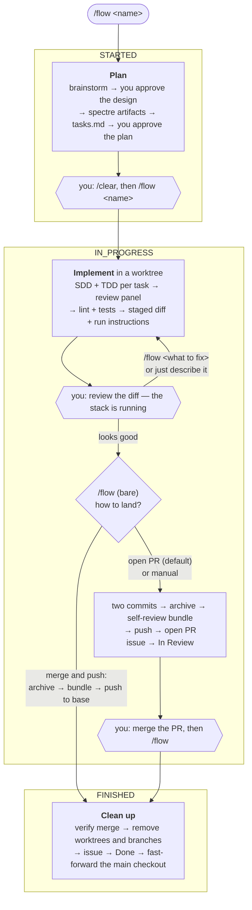

# agents

Portable, project-agnostic agent configuration: the **flow** pipeline (spectre + Superpowers), its
skills and slash commands, always-on rules, hooks, and the stats service that records every run.

**This repository is the source of truth.** Edit files here, then run `./setup.sh global`. Nothing
is ever synced *into* this repo from a project checkout.

---

## Quick start

```bash
./setup.sh global                                          # install into every harness
go install github.com/tweety53/spectre/cmd/spectre@latest  # needed by every skill but /flow-plan
```

Then, in Claude Code, install Superpowers (`/plugin install prime-radiant-inc/superpowers`),
register the hooks the installer prints into `~/.claude/settings.json`, and type `/flow <name>` in
any project.

---

## What's in here

| Path | What it is |
|------|------------|
| `rules/` | Rules. Whether one is always-on is declared by `alwaysApply` in its own frontmatter; opt-in rules (e.g. the Kotlin backend standard) reach only projects that name them. `agent-baseline.md` is not a rule — it is the file every dispatched subagent is told to read |
| `skills/` | The `/flow*` skills; `skills/flow-contracts/` holds the on-demand contracts, with `pipeline.md` canonical for the state machine. Command map: `skills/README.md` |
| `commands-claude/` | Thin slash-command wrappers for Claude Code and ZCode |
| `agents/` | Subagent definitions (`flow-low`, `flow-medium`, `flow-high`) |
| `mods/` | Claude Code plugins. `worktree-lsp` serves `.go`, `.kt` and `.kts` through `stats/cmd/worktree-lsp`, one gopls or kotlin-lsp per git worktree behind one connection: a request waits until its worktree's server finished indexing (each ready time appended to `~/.cache/worktree-lsp/index.log`), workspace symbols fan out to every running server, and a worktree's servers stop at `/flow` cleanup or when it is removed; it replaces the official `gopls-lsp`/`kotlin-lsp` plugins. `flow-task-list` draws a band above the prompt in the task-list look: first a `⎿ <model-effort> <marker> main: <label> — <state>` line for the main agent (`in progress` while its turn runs, `waiting` between turns while a subagent runs), labelled with the top-level unit it is on — the latest open unit of its own `rules/be-brief.mdc` status lines naming a task of the running `/flow` change's plan, else the stage of the run's latest `flow stage begin`, else the latest open unit of its own status lines; then, nested under it as `  ⎿ <model-effort> <marker> Task <x>/<n> (<desc>) — <state> · <elapsed>`, one line per running subagent (`<desc>` alone, unnumbered, unless its description's `Task <x>/<n>` prefix names tasks of the running `/flow` change's plan; a group reads `Task 1+2+3/<n>`), its state `in progress`, `review`, `fix` or `re-review` read from its description; then one `◻ Task <x>/<n> (<title>) — pending` line per task of that plan neither ticked nor landed and named by no running line nor the `main` line, read from `<project>-worktrees/<change>/spectre/changes/<change>/tasks.md` beside the main checkout; a failed subagent's `✘ … — blocked` line among the running ones until the next main turn starts; and, only when no task is pending, the last two done subagent lines of the marked `/flow` change — with none marked, of the current main turn — above the running ones, in the room they leave (`✔` done and struck through, a group as its highest task, `Task 3/<n>`). Status lines are never lines of their own. Five lines at most under `main`. It adds the tracker key, `/flow` phase and the plan's done-over-total task count (`19/25`; a task is done when ticked or its `Task-Id:` commit is on the change branch since its base, `branch.<current>.flowBase` else `origin/HEAD`), then ` │ ` and a tally of the subagent rows, to the hint line under it |
| `hooks/` | `enforce-agent-baseline.py` (denies a dispatch missing the baseline pointer), `protect-main-checkout.py` (denies edits on a main checkout's default branch), `flow-active-change.py` (turns a plain problem report into a fix run) |
| `scripts/` | The guards `/flow` runs, each with its `test-*.sh` harness |
| `stats/` | `flowd` — the PostgreSQL-backed service holding pipeline state and per-stage telemetry, with a web UI. See `stats/README.md` |
| `spectre/` | This repository's own specs and changes |
| `CLAUDE.md`, `AGENTS.md` | This repository's project instructions |
| `templates/` | The `CLAUDE.md` and `AGENTS.md` that `setup.sh` copies into a project that lacks one |
| `setup.sh` | The installer |

---

## Commands

`<name>` is optional everywhere: with one open change it is picked automatically, otherwise you are
asked. No command takes a flag.

| Command | What it does |
|---------|--------------|
| `/flow <name>` | The whole pipeline, one command, re-entrant — see below |
| `/flow-fast <name>` | Lighter variant: worktree, class-decided implementation and panel, lint + targeted tests, default landing route, cleanup. No spectre artifacts or state file |
| `/flow-plan` | Thinking-partner mode, no implementation; a captured session creates the change at `STARTED` |
| `/flow-status [name]` | Read-only report of every open change |
| `/flow-settings` | Global reviewer slots |
| `/flow-self-review <name>` | Runs the self-review pass an older run deferred |

## How the pipeline works

Three states. Every arrow into a box is a `/flow` invocation, and every hexagon is a gate that is
yours.


```mermaid
flowchart TD
    kick(["/flow #lt;name#gt;"]) --> plan

    subgraph S1 ["STARTED"]
        plan["<b>Plan</b><br/>brainstorm → you approve the design<br/>→ spectre artifacts → tasks.md → you approve the plan"]
        g1{{"you: /clear, then /flow #lt;name#gt;"}}
        plan --> g1
    end

    g1 --> impl

    subgraph S2 ["IN_PROGRESS"]
        impl["<b>Implement</b> in a worktree<br/>SDD + TDD per task → review panel<br/>→ lint + tests → staged diff + run instructions"]
        g2{{"you: review the diff — the stack is running"}}
        land{"/flow (bare)<br/>how to land?"}
        pr["two commits → archive → self-review bundle<br/>→ push → open PR<br/>issue → In Review"]
        g3{{"you: merge the PR, then /flow"}}
        impl --> g2
        g2 -- "/flow #lt;what to fix#gt;<br/>or just describe it" --> impl
        g2 -- "looks good" --> land
        land -- "open PR (default)<br/>or manual" --> pr
        pr --> g3
    end

    subgraph S3 ["FINISHED"]
        cleanup["<b>Clean up</b><br/>verify merge → remove worktrees and branches<br/>→ issue → Done → fast-forward the main checkout"]
    end

    land -- "merge and push:<br/>archive → bundle → push to base" --> cleanup
    g3 --> cleanup
```

- **The gate is the state.** No command exists just to record that you reviewed something.
- **A fix never moves the state.** Re-run `/flow` with instructions, or describe the problem in the
  same session.
- **Merge status alone decides** whether a bare `/flow` integrates or cleans up, so a PR merged on
  the forge and one `/flow` merged itself look the same.
- **Run 2 runs no tests or linters** and commits nothing: the archive and the self-review bundle
  ride the change's own branch, landing with the code.

Canonical detail: **State transitions** (`skills/flow-contracts/pipeline.md`), and
`skills/flow-contracts/finish-contract-run1.md` / `finish-contract-run2.md` for landing and cleanup.

### Deciding how to implement (`flow.decide`)

Once `tasks.md` is written, the planner sizes the change and decides how much ceremony it gets,
then prints a `## Decision` table and asks **Proceed to implementation?** before anything runs.

1. **Classify.** `scripts/plan-class.sh` counts tasks, touched files and repositories, and flags
   migrations, spec edits, tasks that leave the build red, and `unverified:` plan claims. It prints
   a class — `micro`, `small`, `regular` or `big`. The planner may raise the class one step with
   a recorded reason, never lower it.
2. **Roll.** The same script prints four rolls, hashed from the change name so they repeat on
   every run of that change: `compact` (a smaller review roster), `experimental` (add one
   reviewer prompt from `skills/flow/experimental/`), `bundle` (fixed or free reviewer grouping)
   and `effort` (below 80, every implementer, fixer and reviewer dispatch runs at `medium`, a
   hard seam alone at `high`; otherwise the planner picks each effort freely).
3. **Decide.** The class and rolls always decide all three. Nothing in a project configures them:

   | Class | Execution | Implementer effort | Review panel |
   |-------|-----------|--------------------|--------------|
   | `micro` | inline | — | the reviewer list in `/flow-settings`, delta re-runs |
   | `small` | inline | — | `primary`+`principles`, delta re-runs |
   | `regular` | inline | — | adds `failure-modes`+`mutation`, delta re-runs |
   | `big` | `sdd`: subagent implementers, one per task group | `medium` on an `effort` roll below 80, else `low`/`medium`/`high` per group, from how hard its tasks are; a verification-only group (end-to-end specs, fidelity captures) always `low` | same roster as `regular`, full re-runs |

   A `compact` roll shrinks any roster except `micro`'s to `primary`+`principles`. A round runs at
   most two review dispatches, with up to three roles each. A `micro` change (at most two tasks,
   documentation only, at most 20 changed lines) makes no choices. It still gets the decision
   record, the verify stage and self-review.

The choice is saved to `.superpowers/sdd/decision.json` in the worktree and recorded in `flowd`.
The Decide step also picks every dispatch's model.
Canonical: **Decide** and **Model and effort** (`skills/flow/brainstorm-planner.md`).

### Level 1 — the stages of each command

Every stage a run marks in `flowd`. `stats/internal/stages/names_test.go` parses this table and
fails if it drifts from the code, so edit both together. `/flow-status` marks nothing; which phase
file marks each key is **Stage keys** (`skills/flow/stage-keys.md`).

| Key | Name | Commands |
|-----|------|----------|
| `flow.kickoff` | Kickoff — write `STARTED` | `/flow`, `/flow-fast` |
| `flow.brainstorm` | Brainstorm ▸ | `/flow`, `/flow-fast` |
| `flow.design-approval` | Design approval | `/flow` |
| `flow.create-artifacts` | Create the spectre artifacts | `/flow`, `/flow-fast` |
| `flow.writing-plans` | Writing-plans ▸ | `/flow`, `/flow-fast` |
| `flow.decide` | Decide — execution, models, panel | `/flow`, `/flow-fast` |
| `flow.load-context` | Load context and validate the plan | `/flow`, `/flow-fast` |
| `flow.isolate-workspace` | Isolate the workspace | `/flow`, `/flow-fast` |
| `flow.document-fix` | Document the fix (re-runs only) | `/flow`, `/flow-fast` |
| `flow.sdd-tdd` | SDD + TDD per task ▸ | `/flow`, `/flow-fast` |
| `flow.review-panel` | The review panel ▸ | `/flow`, `/flow-fast` |
| `flow.verify` | Verify: workspace isolation, lint and test | `/flow`, `/flow-fast` |
| `flow.visual-verify` | Visual verification | `/flow` |
| `flow.stage-diff` | Stage, excluding the planning paths | `/flow`, `/flow-fast` |
| `flow.run-instructions` | Resolve the run instructions | `/flow`, `/flow-fast` |
| `flow.write-in-progress` | Write `IN_PROGRESS` | `/flow`, `/flow-fast` |
| `flow.preflight` | Preflight verdict (decides run 1 vs run 2) ▸ | `/flow`, `/flow-fast` |
| `flow.unfinished-work-gate` | Unfinished-work gate (run 1) ▸ | `/flow`, `/flow-fast` |
| `flow.landing-question` | The landing question (run 1) | `/flow`, `/flow-fast` |
| `flow.preserve-sessions` | Preserve the session records (run 1) | `/flow`, `/flow-fast` |
| `flow.commit-two` | Two commits, implementation first (run 1) | `/flow`, `/flow-fast` |
| `flow.sync-archive` | Archive the change on its branch (run 1) | `/flow`, `/flow-fast` |
| `flow.commit-archive` | Commit the archive (run 1) | `/flow`, `/flow-fast` |
| `flow.self-review` | Run the self-review pass (run 1) | `/flow`, `/flow-fast` |
| `flow.landing-routes` | The landing routes, including moving the issue to In Review (run 1) ▸ | `/flow`, `/flow-fast` |
| `flow.verify-merge` | Verify the merge (run 2) | `/flow`, `/flow-fast` |
| `flow.cleanup` | Cleanup (run 2) ▸ | `/flow`, `/flow-fast` |
| `flow.verify-cleanup` | Verify the cleanup (run 2) | `/flow` |
| `flow.write-finished` | Write `FINISHED` (run 2) | `/flow`, `/flow-fast` |
| `flow.refresh-main-checkout` | Bring the main checkout forward (run 2) | `/flow`, `/flow-fast` |
| `plan.session` | Plan session — the whole `/flow-plan` invocation | `/flow-plan` |

▸ marks a stage with substructure; its procedure lives in the phase file under `skills/flow/`.

---

## Guardrails

The pipeline does not rely on an agent saying it behaved. Checks at each step are scripts that
return a verdict. Each one has a `test-*.sh` harness in `scripts/`, and
`scripts/run-guard-tests.sh` runs every harness.

**Always on, in every session (hooks)**
- `enforce-agent-baseline.py`: blocks any subagent dispatch whose prompt lacks the
  `agent-baseline.md` pointer, so the rules reach every subagent, however deep.
- `protect-main-checkout.py`: blocks edits, staging, commits, stashes and resets on a main
  checkout's default branch. Work happens in a worktree.
- `flow-active-change.py`: routes a plain problem report to the session's open change as a fix run.

**Plan**
- `check-plan-shape.sh`: `tasks.md` must be readable by the commit guards that check it later.
- `check-plan-provenance.sh`: every code block and number in the plan carries `verified:` or
  `unverified:`.
- `check-task-build-green.sh`: every task declares whether it leaves the build green. A red task
  must name the task it gets squashed into.

**Implement**
- `check-task-commit-fields.sh`: each task commit touches exactly the files and tests its task
  declared.
- `check-task-commit-planning-paths.sh`: task commits never include planning files.
- `check-task-records.sh`: no box ticked in `tasks.md` without a commit behind it.
- `check-plan-unchanged.sh` and `check-tree-markers.sh`: snapshot the worktree before a subagent
  runs and compare it after, instead of trusting the subagent's report that the tree is clean.
- `check-dispatch-paragraphs.sh`: required instruction paragraphs stay in the dispatch templates.
- `check-workspace-isolation.sh`: every worktree gets its own database, cache, bucket and ports.

**Review panel**
- `run-reproducer.sh` and `prove-reproducer.sh`: every finding needs a reproducer that shows the
  defect before the fix and passes after it.
- `check-panel-reproducers.sh`, `check-panel-reproducer-exit-contract.sh`: every finding has a
  reproducer, and each one uses the exit codes correctly.
- `check-panel-findings-closed.sh`: no handoff while any finding is open or deferred, whatever its
  severity.
- `mutate-and-verify.sh` and `break-and-prove.sh`: break the code on purpose and show a test
  fails. The `mutation` reviewer uses them.

**Land and clean up**
- `integrate-change.sh`: runs every mechanical step of the integrate and cleanup runs — the guards
  below among them — in four calls, stopping only where a verdict needs a decision.
- `check-finish-preflight.sh`: decides between integrate and cleanup from the merge state, or
  refuses and asks.
- `check-unfinished-work.sh`: reports unticked tasks or open findings before you are asked how to
  land.
- `commit-split.sh`: makes the two commits, implementation first and planning second.
- `check-archive-scope.sh`: blocks an archive commit that reaches outside the archive.
- `check-cleanup-complete.sh`: `FINISHED` is written only once every temporary artifact is gone.

**This repository's own lint.** It runs in `/flow`'s verify stage here:
- `check-references.sh`: every ``**Section** (`file`)`` citation must point at a heading that exists.
- `check-stage-mark-calls.sh`: skills may mark only stage keys `flowd` knows.
- `check-installed-rules.sh`: the rules installed on this machine must match `rules/`.

`.flow/project.md` `## lint` lists them all.

---

## Stats app (`stats/`)

`flowd` is a Go daemon on `127.0.0.1:4173` with PostgreSQL behind it (`flow-postgres` on port
5433). It is the store every `/flow*` command writes to through the `flow` CLI.

- **State.** Each change's pipeline state, worktrees and PR (`flow state`). This replaced the
  per-machine JSON state file. When the daemon is down, writes go to an on-disk journal and are
  replayed later (`flow journal`).
- **Stages and cost.** `flow stage begin/end` marks every Level 1 stage. Every 5 s, `flowd` reads
  new lines from the Claude Code transcripts, assigns each turn's tokens to the stage that was
  running, and prices them at the published per-model rates. A model with no published rate is
  shown as *unavailable*, never estimated.
- **Records.** Review findings with their reproducers, verdicts, subagent dispatches, planner
  decisions and incidents (`flow record`). The guards above read these, not Markdown.
- **Settings.** The default reviewer slots, set by `/flow-settings` (`flow settings`).
- **Jira.** Forward-only status changes (To Do → In Progress → In Review → Done), with retries
  (`flow jira transition`). Off until the three `FLOWD_JIRA_*` variables are set.

**Web UI** at http://127.0.0.1:4173, filterable by project, period and model:
- live state board
- runs, with a per-run stage breakdown
- stage leaderboard
- cost and token trend
- cache efficiency
- planner decisions
- reviewer yield (how often each review slot ran and what it found)

```bash
cd stats && docker compose up -d   # PostgreSQL
make build                          # flowd + flow CLI (builds the SPA first)
```

`stats/README.md` covers:
- the launchd agent that runs `flowd` at login
- the throwaway UI-test stack on port 4174
- Jira credentials
- checking by hand that token usage is being assigned to stages

Never stop the live daemon or drop the `flow` database: every project's runs write to it.

---

## Installation

### Global (recommended)

```bash
./setup.sh global
```

Symlinks skills, commands, agents, hooks and full-text rules into `~/.claude/` and `~/.zcode/`, and
each `mods/<name>/` into `~/.claude/skills/`, from which Claude Code auto-loads it as a plugin, and
writes a managed block of always-on rules into `~/.claude/CLAUDE.md` and `~/.zcode/AGENTS.md`. It
also exports `Z_COMPACT_WINDOW` from `~/.zshrc` (and `~/.bashrc` when present) for the `zcode`
wrapper. While `~/.claude/settings.json` still enables `gopls-lsp@claude-plugins-official` or
`kotlin-lsp@claude-plugins-official`, it prints the `claude plugin disable …` command for each — the
`worktree-lsp` mod replaces them — and never edits that file. There is no Muse layer here:
Muse discovers the Claude Code skills and rules above natively, and its own rules are
project-scope only (see **Muse** below).

- **Edits to existing skills, commands and hooks are live** — they are symlinks. Re-run only when
  a file is added or removed.
- **Edits to an always-on rule need a re-run.** The managed blocks carry rendered text (each rule's
  `<!-- core -->` section plus a `Full rule:` pointer), not a link. Only the text between
  `<!-- flow:begin -->` / `<!-- flow:end -->` is rewritten; your own notes around it survive.
- **Hooks are installed, never registered.** The installer prints the `settings.json` (or ZCode
  `~/.zcode/cli/config.json`) snippet and leaves the paste to you.
- **Whether a subagent reads `CLAUDE.md` depends on the harness and the agent type** — Claude
  Code passes it to some subagent types and not others, and ZCode's and Muse's behaviour is
  unverified — so
  every dispatch still points at `~/.claude/rules/agent-baseline.md`, the one channel that reaches
  every subagent; `enforce-agent-baseline.py` denies one that does not, where the hook is registered.

### Per project

```bash
cd /path/to/project
/path/to/agents/setup.sh <claude-code|zcode|muse>
```

Links skills and commands into the project's `.claude/` or `.zcode/`, or skills into its
`.agents/` on `muse` — that harness has no commands directory, no project agent definitions and
no hooks, so skills and `AGENTS.md` are the whole install. It is
also the **only** way an opt-in rule reaches a project: it reads the `## standards` section of
`<project>/.flow/project.md`, keeps bare `*.mdc` names from `rules/` that are not already
always-on, and renders them into a managed block in both `<project>/CLAUDE.md` and `AGENTS.md`.
Re-run it in each adopting project after editing an opt-in rule.

### Claude Code

Install Superpowers with `/plugin install prime-radiant-inc/superpowers`. Without the command
wrappers in `commands-claude/`, typing `/flow` fails with "Unknown command" — Claude Code finds
skills by name, not by slash alias.

### ZCode

ZCode has no Superpowers plugin channel; copy the skills once:

```bash
cp -R ~/.claude/plugins/cache/claude-plugins-official/superpowers/<version>/skills/* ~/.zcode/skills/
```

Everything ZCode uses lives under `~/.zcode/`, with rule pointers rewritten from `~/.claude/`. It
picks the model per session, not per command: switch to a stronger one before a creating `/flow`
run.

### Muse

Muse reads project skills from `<project>/.agents/skills/` and project rules from
`<project>/AGENTS.md` — `./setup.sh muse` installs both — and discovers the global flow
skills and always-on rules through the Claude Code layer (`~/.claude/skills/`,
`~/.claude/CLAUDE.md`), so `setup.sh global` covers it with no Muse-native layer. It has
no commands directory, no hooks and no per-dispatch model: every dispatch inherits the
session's own model and effort (**Harness mapping**, `skills/flow-contracts/model-policy.md`),
so switch to a stronger model before a creating `/flow` run, as on ZCode. Without the
`flow-active-change` hook, a plain problem report becomes a fix run from the session's own
context alone. Superpowers, like ZCode, has no plugin channel here — install its skills
with `muse skills install <path>` per skill, or copy them into the project's
`.agents/skills/`.
