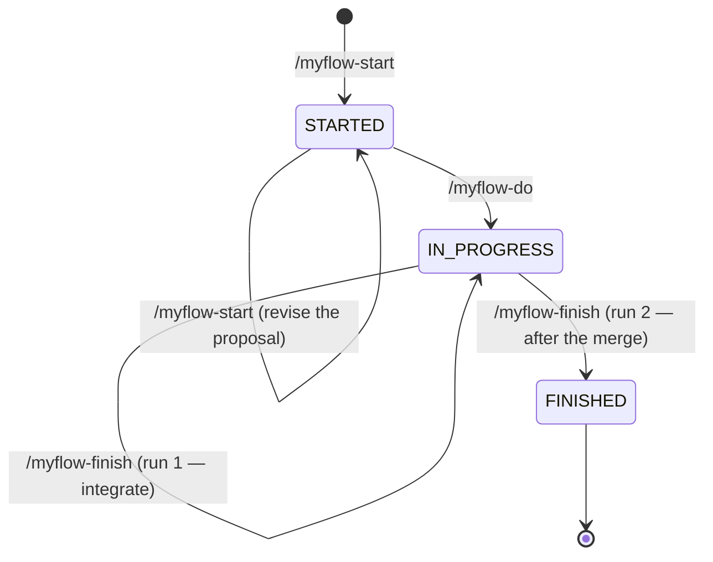

# myflow pipeline

The three-state pipeline itself: state definitions, the command→state transition table, git
boundaries, the handoff shape, and the finish contract.

**Load this file when running any `/myflow-*` command.** It is split out of
`rules/myflow-manual-review.mdc` so the always-on rule layer carries only the trigger, not the
whole state machine — the same reason the four contract files beside it were split out.

This file is **canonical** for everything in it. Where a skill or command disagrees with it, this
file wins.

## States

A change is always in exactly one of three states, recorded in its state file.

```text
/myflow-start  → STARTED      you: read the proposal artifact
/myflow-do     → IN_PROGRESS  you: review the staged diff and run the apps
/myflow-finish → FINISHED     terminal (second run — see the finish contract)
```

**Each command ends in the state named after it**, so the state vocabulary and the command
vocabulary are the same words.

**The human gate is a property of the state, not a separate stage.** `IN_PROGRESS` *means* a
staged diff and a test guide are waiting for the human. Nothing records that the review or the
testing happened; the operator running the next command is what carries the change forward. This
is why no `*-done` command exists — there would be nothing for one to write.

| State | Means | Waiting on |
|-------|-------|-----------|
| `STARTED` | The proposal exists and is published | you — read the artifact |
| `IN_PROGRESS` | The implementation is staged and a test guide exists | you — review the diff, run the apps |
| `FINISHED` | Archived, pushed, worktrees removed | — |

**Reviewing and testing are one gate.** `/myflow-do` produces both surfaces in the same run, so
the human does both at one sitting. There is no state between implementation and finishing —
integration is not a stage, it is the first half of finishing.

## Pipeline flow

The diagram and the stage table below are the only copy in this repository. Every command summary
elsewhere — the `/myflow-*` tables in `README.md`, `skills/README.md`, `CLAUDE.md` and `AGENTS.md` —
says what each command is *for* and cites the level-1 table for the stages, rather than carrying a
second ordered list of them; no skill carries one either. All four used to, and the copies had
already drifted: not one of their `/myflow-do` rows named the state gate or the fix-documentation
stage, so an agent working from an entry-point file alone would have skipped both. That is the whole
argument for keeping the stages in one place, and it is why a summary elsewhere may name a command's
purpose but never its order. Placing them here is what lets
`/myflow-info` show them: that command reads this file at invocation time and is forbidden from
answering from memory, so a diagram held only in `README.md` is one it can never present.



### Level 1 — the stages of each command

**One row per command** — the five this pipeline has, three of them pipeline commands and two
read-only, exactly as **Command surface** (`pipeline.md`) below names them. A stage marked ▸ hides
substructure and is expanded at level 2 below. The gate column is the human gate that *follows* the
run — a property of the state the command ends in, never a stage of its own.

`/myflow-finish` is one command with two runs, so its row carries both, labelled: the preflight
verdict picks which one this invocation performs, and the run is never a command of its own.

| Command | Stages, in order | Gate after it |
|---------|------------------|---------------|
| `/myflow-start` | resolve the change → ask the planning effort and the three model choices *(creating run only)* → brainstorm ▸ → design approval → create the OpenSpec artifacts → writing-plans ▸ → publish the proposal artifact → write `STARTED` | you read the proposal artifact |
| `/myflow-do` | state gate → load context and validate the plan → isolate the workspace *(first run only)* → document the fix *(re-runs only)* → SDD + TDD per task ▸ → the review panel ▸ → write the manual test guide → validate the project's `## workspace isolation` section, then export what it declares → run the project's lint and test commands → stage, excluding the planning paths → write `IN_PROGRESS` | you review the staged diff **and** run the apps against the guide |
| `/myflow-finish` | the preflight verdict ▸, taken once per recorded worktree, decides which run follows — *run 1:* the unfinished-work gate ▸ → the landing question → preserve the session records → two commits, implementation first → the landing routes ▸ → move the issue to In Review → write `IN_PROGRESS`; *run 2:* verify the merge → sync delta specs and archive → commit and push the archive → cleanup ▸ → verify the cleanup → write `FINISHED` → self-review ▸ | after run 1, you wait for the branch to merge; after run 2, nothing — the state is terminal |
| `/myflow-status` | read-only — no stages, no state write; regenerates a handoff block when given a change name | — |
| `/myflow-info` | read-only — no stages, no state write; reads this file and explains the pipeline | — |

### Level 2 — the stages that hide substructure

Each expansion states the **structure** — the shape that changes only when the pipeline changes —
and cites the file that owns the tuned values. A threshold copied here is a copy that goes wrong
silently, which is the same reason the README carries no diagram; accepting it one level down would
make the rule contradict itself.

#### Brainstorm — `/myflow-start`

superpowers:brainstorming runs its checklist in full and ends with the operator approving the
design, which is a **hard gate inside the command**: nothing is created under `openspec/changes/`
until that approval lands. The approved design is saved under `docs/superpowers/specs/` and is the
source for the change's OpenSpec design artifact — adapted, never duplicated into a conflicting
second design.

**The stage iterates rather than passing once.** After every planning-stage exchange — a round of
clarifying questions, the approval of a design section, the operator's review of the written spec —
one convergence test asks whether the command now holds a question its inputs do not answer, and
while it does, another round opens or is offered. The stage itself ends only on an explicit
operator answer — at the confirm, or by declining the offer, recording what is still open rather
than assuming it away — never on the command's own judgment, with one bounded exception: a session
that cannot ask at all records the confirm itself as an open question and ends the stage, since no
operator answer could ever arrive through it. An operator who is present but silent is not that
exception and still gets another round. One test after every exchange rather than a rule per gate is
the load-bearing part: a gate added later inherits the loop instead of escaping it by not being
enumerated.

The threshold, the two prompts, the bounded exception, and why their opposite recommendations are
both honest are **Convergence** (`skills/myflow-start/SKILL.md`), and are not restated here.

The planning level recorded on the creating run sizes the thinking *inside* this gate and never the
gate itself. The three levels and which of them is the default are owned by
**Planning effort** (`skills/myflow-contracts/state-file.md`) and are not restated here.

#### Writing-plans — `/myflow-start`

superpowers:writing-plans enriches `tasks.md` from a checkbox scaffold into a plan whose every item
carries exact paths, verification commands and no placeholders — the unit `/myflow-do`
dispatches one implementer against. Its self-review — spec coverage, placeholder scan, type
consistency — runs before the stage finishes.

Every fenced block and every numeric claim in a planning artifact carries a provenance tag,
`verified:<how>` or `unverified:`, and `scripts/check-plan-provenance.sh` is what makes that
mechanical rather than a habit. An unverifiable snippet is tagged and **kept**: a plan without the
snippet is worse than a plan carrying a labelled guess.

A revision round re-enters at this stage and republishes the proposal artifact to the **same** URL
rather than minting a second one.

#### SDD + TDD per task — `/myflow-do`

One implementer dispatch per checkbox in `tasks.md`, or per tightly coupled group, in plan order.
Every dispatch carries the same four required blocks — the no-commits boundary,
superpowers:test-driven-development as a required sub-skill, `engineering-principles.md` as required
reading, and the plan-provenance rule above — and names its model explicitly rather than inheriting
the parent's.

The task's diff is written to a file and the reviewer is given that path, never a commit range,
because nothing is committed at this stage. A checkbox is marked `[x]` only after its task passes
spec **and** quality review; a blocked task pauses and reports rather than guessing.

Which model a dispatch runs on, and the rule that every dispatch records it, are
**Model policy** (`pipeline.md`) below.

#### The review panel — `/myflow-do`

**Three required slots and four conditional ones.** Primary, Bugbot and Principles run on every
change; Security, Adversarial and the two extra principle lenses — B for simplicity and state, C for
robustness and ops — are selected from what the diff touches. Each selected slot is a **separate**
subagent with its own prompt, in every affected worktree; two slots are never merged into one.

**Every slot runs on the panel's model — Sonnet by default — except the two dispatched by
`subagent_type`.** Bugbot and Security Review carry their own agent definitions and take no model
override, which is also why their ledger entries read `unknown (agent-defined)`. There is no
parent-model inheritance and no economy tier: the panel's cost must not depend on the model the
operator happens to be running. That default, the change-level choice recorded against it, and the
operator override that may raise it are **Model policy** (`pipeline.md`) below, and are stated there
rather than a second time here.

**No handoff while any finding is open, at any severity.** A minor finding blocks exactly as a
critical one does. Every finding is recorded twice — as a row for the reader and as a marker line
for the guard — and `scripts/check-unfinished-work.sh` reads only the marker block.

**Re-runs are targeted by default and escalate to the full roster automatically**, without asking.
Escalation widens the panel's **breadth** — more lenses — and never its model, because the
implementers it would raise already sit at the ceiling. When a finding survives its last fix round
the run **hands back to the operator**, one finding at a time, with named options; only the
operator's answer may write a `withdrawn` marker, and only with the reason they give.

The tuned values are cited rather than copied. Which diff sizes and which touched areas select a
conditional slot is **Optional slot selection** in `skills/myflow-do/SKILL.md`; the conditions that
force a full re-run in place of a targeted one are **Panel re-runs** in `skills/myflow-do/SKILL.md`.

#### The preflight verdict — `/myflow-finish`

`scripts/check-finish-preflight.sh` decides which run happens, from three signals in a fixed order,
taken once per worktree recorded in the state file. It prints exactly one verdict line and exits 0
whenever it reached a verdict; **a missing verdict line is not a verdict**, and neither is a
worktree it cannot read. `RUN1` integrates, `RUN2` archives, and `REFUSE` **stops the run** and asks
the operator rather than guessing. Run 2 proceeds only when every recorded worktree returns `RUN2`.

The three signals and why their order is load-bearing are **Finish contract** (`pipeline.md`) below.

#### The unfinished-work gate — `/myflow-finish` run 1

Runs **before** the landing question and before any git action, once per recorded worktree.
`scripts/check-unfinished-work.sh` returns `CLEAR` — go straight to the question, with no extra
prompt — or `OUTSTANDING`, which shows the breakdown and offers **exactly three** courses, with
**Stop** marked as the recommendation. There is no fourth course, and none that hands back to
`/myflow-do` inline.

The ordering is the point: an operator asked how to land a branch, and only then told it carries
unfinished work, has already answered a question about a branch they believed was complete. What
was integrated over is written into the planning commit's message and into the handoff, so the
record outlives the session.

Each course and what run 1 then does are **Run 1 — the branch is not merged** (`pipeline.md`) below.

#### The landing routes — `/myflow-finish` run 1

The operator is asked once, before any git action, how the branch should land: open a pull request
*(default)*, merge and push, or handle it manually. The run then completes without asking again, and
the answer is never remembered between runs.

All three routes do the same two things first, in this order: preserve the session records out of
the gitignored worktree into the repository, then commit in **two** commits — implementation first,
planning artifacts second. The linked issue moves to In Review on every route, including the manual
one. Run 1 ends at `IN_PROGRESS` and names itself as the next command, because that is what the
operator runs once the branch is merged.

The route table is **Run 1 — the branch is not merged** (`pipeline.md`) below; the guarded
two-commit chain every route uses is **Git boundaries** (`pipeline.md`) above.

#### Cleanup — `/myflow-finish` run 2

Every removal is *remove-or-move if present*, which is what makes run 2 re-entrant: a step whose
artifact is already gone is a success rather than an error, so a re-run after the operator clears a
leftover repeats the verification and nothing else.

The removals are verified rather than assumed. `scripts/check-cleanup-complete.sh` runs once per
repository, **after** all of them: `COMPLETE:` allows the `FINISHED` write, `LEFTOVER:` names what
remains and leaves the change at `IN_PROGRESS`, and a non-zero exit carrying no verdict line is
treated exactly as `LEFTOVER` — an unverified cleanup is not a verified one. A `COMPLETE:` line may
carry a `SKIPPED:` clause naming a row that was not verified, and that clause is relayed rather than
dropped — the rule is stated once in step 6 of
**Run 2 — the branch is merged** (`skills/myflow-contracts/pipeline.md`) below.

What is removed, when, and on what condition is
**Temporary artifacts registry** (`pipeline.md`) below — the one place a cleanup rule is stated. The
procedure for the rows it removes is **Worktree cleanup** (`pipeline.md`).

#### Self-review — `/myflow-finish` run 2

Self-review runs only after `FINISHED` is written — never before it, and never in a run that stops
earlier. It is skippable per run, with running it the default. It gathers its input by invoking
`scripts/gather-self-review-context.sh` rather than having the reasoning pass re-read files inline,
runs **one** combined reasoning pass covering all four angles — problems and fixes, cost, what went
well, and automation candidates — together with the operator's 1-5 rating, never as four separate
dispatches, and offers a per-finding Jira filing ask before committing its report to
`docs/self-review/<name>-self-review.md`.

**Which file to change first.** The normative requirement is
**Requirement: Self-review runs only after FINISHED is written** (`openspec/specs/myflow-self-review/spec.md`),
read alongside the sibling requirements in that same file for context gathering, the combined pass,
the per-finding filing ask, the rating, and the report path. Naming the requirement in full, rather
than giving the path alone, is what makes `scripts/check-references.sh` check this pointer — an
OpenSpec `### Requirement: …` heading is a heading like any other. The guard skips a path that does
not resolve, so this one is checked only once the capability lands in `openspec/specs/` at finish
run 2; until then it is a reference nobody verifies, which is said here rather than left to look
otherwise, exactly as **Planning effort** (`skills/myflow-contracts/state-file.md`) already states
for its own forward reference.

## Command surface

Three pipeline commands and two read-only ones. **No command accepts a flag.** The only argument
is the optional change name — see **Change name resolution**.

Behaviour a flag used to select is now either asked at invocation (the integration choice in
`/myflow-finish`), derived from the current state, or fixed at the single sensible default
(review-panel breadth, decided by its escalation triggers).

An argument that is not a known change name is **reported**, not silently ignored — a silently
ignored word is indistinguishable from a flag that stopped working.

## State transitions

| Command | Accepts | Ends at |
|---------|---------|---------|
| `/myflow-start` | *(none — creates the change)* · `STARTED` | `STARTED` |
| `/myflow-do` | `STARTED` · `IN_PROGRESS` | `IN_PROGRESS` from `STARTED`; **otherwise unchanged** |
| `/myflow-finish` | `IN_PROGRESS` | `IN_PROGRESS` after run 1; `FINISHED` after run 2 |
| `/myflow-status`, `/myflow-info` | any — read-only, never block | unchanged |

**This table is authoritative.** Every command file — in **both** command trees (`commands/` and
`commands-claude/`) — must state exactly the states its row lists, and must agree with the skill it
delegates to. When a command and its skill disagree, whichever the agent reads first wins, which is
non-determinism in the one layer that must be deterministic.

### Every command is re-entrant

Re-invoking a command is the supported way to revise its output. There is no separate `*-fix`
command:

- **`/myflow-start` at `STARTED`** revises the proposal and republishes the artifact to the
  **same** URL.
- **`/myflow-do` at `IN_PROGRESS`** resumes the existing worktree and applies a fix, documenting it
  in `proposal.md`/`tasks.md` or a nested `<name>-fix-N` sub-change first, and refreshing the test
  guide alongside the code so the two surfaces never drift apart.
- **`/myflow-finish` at `IN_PROGRESS`** integrates on its first run and archives on its second.

### A fix never moves the state

`/myflow-do` advances the state **only** from `STARTED` to `IN_PROGRESS`. From `IN_PROGRESS` it
writes the state back exactly as it found it.

No field records where a fix was raised. Whether the human re-reviews the diff or re-runs the apps
after a fix is their decision.

## Wrong state for this command

**On a mismatch, stop.** Report the actual state, the states the command expects, and the command
that should run instead, then **AskUserQuestion** for an explicit override with **"No — run the
suggested command instead"** as the default and recommended answer. Only proceed when the user
explicitly chooses to override. Never advance from a wrong starting state silently.

```
## Wrong state for this command

**Change:** <name>
**Current state:** <actual> (set by <updatedBy>, <updatedAt>)
**This command expects:** <expected>
**Suggested instead:** /myflow-<other> <name>
```

## Git boundaries

| Command | Condition | Allowed git actions |
|---------|-----------|---------------------|
| `/myflow-start` | — | **None — stages planning artifacts and never commits** |
| `/myflow-do` | from `STARTED` | Create branch/worktree + **`git add` excluding the planning paths** — no commits, push, merge, or PR |
| `/myflow-do` | at `IN_PROGRESS`, no `prUrl` | Resume **existing** worktree + **`git add` excluding the planning paths** — no commits |
| `/myflow-do` | at `IN_PROGRESS`, `prUrl` recorded | **Commits twice and pushes** to the PR branch — implementation, then planning artifacts; the one exception |
| `/myflow-finish` | run 1 | **Commits twice** — implementation, then planning artifacts — and pushes; opens a PR or merges, by the operator's choice |
| `/myflow-finish` | run 2 | **Commits and pushes the archive**; removes worktrees and branches |
| `/myflow-status`, `/myflow-info` | — | None — read-only |

**Why `/myflow-do` commits once a PR exists and not before.** A PR is a remote surface, so a
staged-only fix would be invisible on it. Before that the operator reviews a staged diff in the
IDE, and committing would take that away.

**The planning paths** are the three that
**Handoff output** (`pipeline.md`) names below. `/myflow-do` clears them from the index and only
then stages with them excluded by pathspec — an exclusion governs what an
`add` adds and cannot retract what an earlier step staged, so the clearing pass is what makes the
rule hold rather than merely assert it. Its staging area therefore carries implementation only, and
`/myflow-finish` is what commits them.

`git add -A` respects `.gitignore`. Never force-add.

**Both commits are guarded, and an empty one is skipped rather than failed.** `git commit` exits
non-zero when nothing is staged, so an unguarded two-commit sequence dead-ends on three ordinary
cases: a fix touching only the three planning paths leaves the implementation commit empty — which
is exactly what run 1's unfinished-work **Stop** course invites — a fix touching only implementation
leaves the planning commit empty, and a re-run after a rejected push finds both commits already
made. Each commit is therefore preceded by a staged-changes test, and the whole sequence is one
`&&` chain:

```bash
git -C <abs-worktree> reset -q -- openspec/ docs/manual-test/ docs/superpowers/ \
  && git -C <abs-worktree> add -A -- . ':(exclude)openspec/' ':(exclude)docs/manual-test/' ':(exclude)docs/superpowers/' \
  && { git -C <abs-worktree> diff --cached --quiet \
       || git -C <abs-worktree> commit -m "<type>(<name>): <what the implementation does>"; } \
  && git -C <abs-worktree> add -A \
  && { git -C <abs-worktree> diff --cached --quiet \
       || git -C <abs-worktree> commit -m "chore(<name>): plan, test guide and session records"; }
```

**A skipped commit is reported, and a FAILED commit stops the sequence.** Those are different
outcomes: "nothing to commit" is normal and costs one line in the handoff, while a commit a hook
rejects is a git failure and gets the standard treatment — report git's own output and stop. The
chain is what enforces the second, and it is a chain rather than `set -e` deliberately: bash before
4.0 ignores `set -e` inside a subshell whose parent has errexit off, and this block runs through an
agent's shell whose state it does not control. Run it as one command. Without that, a first commit
a hook rejects falls through to the unconstrained second `add`, and the sole resulting commit —
titled `chore(...)` — carries the implementation, silently breaking the very split this section
exists to enforce.

**A planning path that is a tracked symlink stops the run, and is never worked around.** When any of
the three is a symlink, `git add -A -- . ':(exclude)docs/superpowers/'` exits 128 with
`fatal: pathspec … is beyond a symbolic link` and stages **nothing at all**. Report that message,
name the path, and stop at `IN_PROGRESS`. The only way to stage past it is a bare `git add -A`,
which puts the planning artifacts into the implementation commit — the one outcome this split
exists to prevent — so the fix belongs in the repository, by making the path a real directory.

## Progress visibility

**Every pipeline command drives the harness's task-list mechanism.** `/myflow-start`, `/myflow-do`
and `/myflow-finish` register their steps with it at the start of a run and keep each entry's status
current — in progress when its step begins, completed when that step finishes — so the harness's
live progress view, a count line and one line per task, renders throughout the run rather than
arriving with the handoff. The count line then distinguishes done, in progress and open at every
point.

| Command | One entry per |
|---------|---------------|
| `/myflow-start` | its brainstorming checklist item and each artifact it produces |
| `/myflow-do` | each item in `tasks.md`, in plan order |
| `/myflow-finish` | each step of the run it is performing — run 1's steps or run 2's, never both |

`/myflow-status` and `/myflow-info` are read-only and **register nothing**. Registering steps for a
report would put entries on the operator's task list for work nobody is doing.

**The progress view is a view, never a record.** No command, guard or contract reads the harness's
task list back as evidence of what was done. `tasks.md` remains the single source of truth for a
plan's completion state, and `scripts/check-unfinished-work.sh` reads that file — a second source of
completion state would be one that guard cannot see.

**No third checkbox marker is added to `tasks.md`** to carry an in-progress state. A marker written
at dispatch and resolved at completion would survive a crashed run as a permanently in-progress
task, in a file two guards parse. The in-progress count comes from the harness's task list alone,
which no run persists.

**Stated against the mechanism, never against one harness's tool.** myflow runs in Claude Code,
Cursor and Codex, and a rule written against one harness's API is unimplementable in the other two.
Where a harness offers no task-list mechanism, the command prints the equivalent block in its output
instead: a count line naming how many steps are done, in progress and open, followed by one line per
step marked done or not done. The rule is satisfied by whichever mechanism the harness provides, and
no harness has to gain a task tool to satisfy it.

## Handoff output

Every command ends in the same shape, and prints **nothing** after it:

```
<1–3 lines: what actually happened>

<absolute paths to anything the operator needs to open>

Next:
/myflow-finish <name>
```

- **The next command is the last line** — bare, copy-pasteable, with no prose after it. An agent
  cannot drive a harness's autocomplete; nothing lets a running session prefill the operator's
  input box. The last-line convention plus a five-command surface is the whole mechanism.
- **`/myflow-finish` run 1 names itself** as the next command, because that is what the operator
  runs once the branch is merged. Only a run 2 that **completed** is terminal and names nothing — a
  run 2 that stopped on a cleanup leftover names itself too, for the same reason: the operator
  clears what remains and runs it again.
- **Only what the operator must act on.** Do not restate the plan, enumerate completed internal
  steps, or repeat content available at a path you just gave.
- **Link, never paste.** Manual test guides, diffs and plans are given as absolute paths.
- **Every path is absolute** — in handoffs, in generated guides, in IntelliJ commands, in run
  instructions. Never a relative path, never `../<other-app>`, and never a main-checkout path while
  an apply worktree holds the work. Resolve app roots from `git worktree list` or the state file's
  `worktrees` keys.
- **`/myflow-do` never stages `openspec/`, `docs/manual-test/` or `docs/superpowers/` before
  finish.** The plan was read at `STARTED`; presenting it again as code to review hides the
  implementation diff it is mixed into. Leaving them unstaged, rather than filtering them out of one
  display command, is what makes them absent from *every* view of the staging area — a filtered
  display leaves them in the index, where `git status`, a graphical client and the IDE's
  staged-changes pane show them again. The list is fixed here rather than configured per project; the
  pipeline chooses these paths
  itself, so no project can differ. `/myflow-finish` run 1 stages them and commits them separately
  from the implementation, so nothing is lost:

  ```bash
  git -C <abs-worktree> diff --cached --stat
  git -C <abs-worktree> diff --cached
  ```

### The block each state renders

The block a state hands off is defined **here and nowhere else**, as one template per rendering. Two
commands render it: the command that ends in that state, and `/myflow-status <name>`. **No command
stores the emitted text.** `/myflow-status <name>` regenerates the block from the state file and the
artifacts as they now stand; it never reads back a stored copy, because a stored copy reproduces the
original exactly and then goes wrong silently the moment anything it names moves — a worktree
removed, an artifact republished, a PR opened. Regeneration is the mechanism, not an implementation
detail of it.

**The template is the definition, and it carries what the commands print.** A field a command emits
and the template omits is drift the moment `/myflow-status` renders the same state: the two blocks
would differ in the one place this section exists to keep identical. So each template below carries
every field its command emits, under that command's own label and in its `**Label:**` style, and a
field added to a command is added here in the same change. Labels are the part that must match; the
`<…>` placeholders describe each value rather than reproducing the alternatives a command writes.

**"Here and nowhere else" is a duty on the producing skills, not a claim about them.** Each of the
three — `skills/myflow-start/SKILL.md`, `skills/myflow-do/SKILL.md` and
`skills/myflow-finish/SKILL.md` — carries the block it prints, and each **cites this section as the
definition** at that block. A block sitting in a skill with no citation is a second, independently
authored definition however faithfully it happens to match today, and it is exactly how the two
copies drift: nothing tells the next editor of the skill that this file exists. The citation is what
turns three copies into one definition and three renderings of it.

**What a skill's block may differ in, and what it may not.** The **label set and the field set are
identical** — same labels, same order, no field in one and not the other; that is the part
`/myflow-status` has to reproduce. What a skill *may* do is **enumerate**, in place of a
placeholder, the literal alternatives its own command writes: this file describes a value's space
across both renderers, while a skill states what that one command emits. An enumeration is
therefore a refinement of the placeholder beside it and must stay **inside** it — a skill that lists
fewer cases than the placeholder describes is narrowing the contract, and teaches a reader to drop a
case the rule above requires. The missing rule and the run-only rule below bind both files equally.

**A value the state file does not carry is reported as missing, not dropped.** A block whose
artifact URL reads *missing* is distinguishable from one whose URL was never printed at all; a
silently absent line is not.

**A run-only field is not a missing one, and the two are never collapsed.** *Missing* means the
block could have carried the value and did not — the state file has the key and it is `null`.
**Run-only** means no regenerated block can ever carry it, because nothing on disk holds it: it
exists only inside the run that emitted it. `(run-only)` immediately after a label in a template
below marks such a field — the command ending in the state prints it, and `/myflow-status` omits it
rather than reporting it missing. Reporting a run-only field as *missing* would tell the operator
something is wrong when nothing is, which is the opposite of what the rule above buys. The marker
annotates the template and is never text a command prints.

Only the form carrying a change name regenerates a block. `/myflow-status` with no argument stays
the table it is today. Regenerating performs no action named in the block it prints — the command is
read-only in both forms.

**`STARTED`** — printed by `/myflow-start`, regenerated by `/myflow-status <name>`

```text
## Proposal ready — review required

**Change:** <name>
**Artifact:** <artifactUrl, or "missing">
**Decisions recorded:** <count, or "none">
**Open questions:** <count, or "none">
**Jira:** (run-only) <issue key and the transition made, or "none linked", or a skipped-with-reason line>
**Jira description (pre-edit):** (run-only) <the text as it stood before the write, verbatim in a fenced block>
**Planning effort:** <the level in force, or "not recorded — planned at default">
**Models:** implementation <model, or "not recorded">, review panel <…>, panel fixes <…>

Open in IntelliJ:
open -na "IntelliJ IDEA" --args "<absolute main-checkout path>"

<what the operator does next>

Next:
/myflow-do <name>
```

**Why the `Jira` line is run-only.** It reports the transition *this run made*, and nothing on disk
records one: the state file carries the bare `jiraIssue` key and no transition history at all. Nor
can the value be re-derived by asking the tracker — `/myflow-status` is forbidden from calling Jira,
its own guardrail being that the report is read-only and never transitions or queries an issue — and
even a permitted read would not recover it, because a current status cannot separate `→ In Progress`
from *already In Progress (no transition)* without the status as it stood before the run, which
nothing records. Two of the line's three alternatives are therefore unreproducible, and the third,
*none linked*, is not worth a line that would be wrong for every other change. The key itself is not
lost with it: `/myflow-status` surfaces `jiraIssue` in its table's Jira column and as the first entry
of its detail view, so what the omission drops is the transition, which is the run-only part.

**Why the open-questions line is not run-only, and carries no marker.** It is derived from an
artifact on disk — the entries under `## Open questions` in the change's design whose status is
still `open` — exactly as the decisions count above it is, so `/myflow-status <name>` regenerates it
rather than omitting it. The two lines sit next to the `Jira` line and are the opposite case to it:
what makes that one run-only is that nothing on disk holds it, and that test is about where the
value lives, not about how close it sits to a line that failed it. A count that has changed since
`/myflow-start` printed it — a revision round answered a question and moved the entry to
`answered by <decision-id>` — is this field working: the line reports what is open now, not what was
open then. It reads `none` when nothing is open, by the missing-rather-than-dropped rule above. The
entry shape, the immutable ID and the never-delete rule the count reads through are stated once
under **Open questions** (`skills/myflow-start/SKILL.md`) and are not repeated here.

**`IN_PROGRESS`, after `/myflow-do`** — printed by `/myflow-do`, regenerated by `/myflow-status <name>`

```text
## Implementation staged — review and test

**Change:** <name>
**Panel:** (run-only) <the required slots, and the optional ones selected or "none — no triggers fired">
**Progress:** <completed>/<total> tasks
**Git:** <staged and uncommitted, committed and pushed to the PR branch, or committed and pushed with no PR — run 1 merged it or handed it over>
**Jira description (pre-edit):** (run-only) <the text as it stood before the write, verbatim in a fenced block>

Worktree:   <absolute worktree path>
Test guide: <absolute path to the guide, or "missing">

Review the diff, then run the apps against the guide:
  <the review command that matches the Git line — see below>
  open -na "IntelliJ IDEA" --args "<absolute worktree path>"

<what the operator does next>

Next:
/myflow-finish <name>
```

**The `Git` line has a third option, and the review command follows it.** `/myflow-do` itself only
ever emits the first two — it stages, or it commits and pushes to a PR branch. The third is reached
only when `/myflow-status` regenerates this rendering for a change whose run 1 took the *merge and
push* or *handle it manually* route: the work is committed and pushed with no `prUrl` to prove it.
Leaving the field at two options meant that block stated something untrue about every such change,
and the pair below is what the command prints instead:

| `Git` line | Review command |
|------------|----------------|
| staged and uncommitted | `git -C <absolute worktree path> diff --cached` |
| committed and pushed to the PR branch | `git -C <absolute worktree path> diff <merge base>..HEAD` |
| committed and pushed with no PR | `git -C <absolute worktree path> diff <merge base>..HEAD` |

**A committed branch has an empty staged diff, so `--cached` is not a sparse answer there — it is a
wrong one.** It exits 0 printing nothing, which reads to an operator as "there is nothing to
review". The merge base is the value already recorded against that worktree's key in the state
file's `worktrees` map, so no new field is needed and nothing has to be inferred; a worktree with no
recorded merge base falls back to the staged-diff line and says the range could not be resolved.

**`IN_PROGRESS`, after `/myflow-finish` run 1** — printed by run 1, regenerated by `/myflow-status <name>`

```text
## Branch integrated — <waiting on the merge, or merged and waiting on run 2>

**Change:** <name>
**Route:** (run-only) <pull request, merged and pushed, or manual>
**PR:** <prUrl, or why there is none on the route taken>
**Outstanding:** (run-only) <what the unfinished-work gate reported and the operator integrated over, or "none">

<what the operator must do before the next run>

Next:
/myflow-finish <name>
```

**`IN_PROGRESS` has two renderings, and one template could not have served both.** Run 1 ends at
`IN_PROGRESS` but hands off a branch waiting on a merge rather than a diff waiting on review: a
worktree path, a test-guide path and a staged-diff command are all wrong for it, and it prints none
of them. Forcing both into one template would leave the rule at the top of this section
unsatisfiable rather than merely unsatisfied — no single block is correct for both commands.

**Why `Route` and `Outstanding` are run-only.** The landing answer is never remembered between runs,
per **Run 1 — the branch is not merged** (`pipeline.md`) below, so no field records which route was
taken: a recorded `prUrl` implies the pull-request route, and nothing separates the other two. The
outstanding list is the unfinished-work gate's verdict at the moment run 1 asked; its durable copy
is the planning commit's message, which is where a later reader looks, and the state file does not
carry it.

**Why `Panel` is run-only.** It names the roster *that run selected* — which optional slots fired
and which did not — and no field carries it. The only on-disk trace is the panel record
`/myflow-do` writes under `.superpowers/sdd/`, which is gitignored, sits in a worktree run 2
removes, and may legitimately be absent for a change that ran no panel; a value that is sometimes
there and sometimes not is not a source `/myflow-status` can regenerate from, and reporting it
*missing* on every change whose worktree is gone would name a fault where there is none. The
durable copy is the preserved record under `docs/superpowers/reviews/`, which run 1 writes into the
repository — an operator who needs the roster after the fact reads that, not a regenerated block.

**Which rendering `/myflow-status` regenerates.** **Merge status decides it whenever the merge
status is known**, and the command already has that answer: it runs the merge-status test in its own
step 2 to fill the next-command column. A branch proven to have reached the base branch **is**
integrated, so the run-1 rendering is the correct one for it, whatever `prUrl` says. `prUrl` is the
tiebreaker only where the stronger signal is genuinely absent:

| Merge status | `prUrl` | Rendering |
|--------------|---------|-----------|
| **no commits of its own** — `HEAD` is still the recorded merge base | either | `/myflow-do` |
| merged (proven) | either | run 1 — and its heading reads *merged and waiting on run 2* |
| not merged (proven) | either | run 1 — *waiting on the merge* |
| inconclusive | recorded | run 1 — *waiting on the merge* |
| inconclusive | none | `/myflow-do` |

**The first row is a pre-check, not a special case, and it must be answered before the ancestor
test.** `git merge-base --is-ancestor HEAD <base>` returns **true** for a branch carrying no commits
of its own — every commit it has, the base branch already had — and that is the *ordinary*
`IN_PROGRESS` shape, because `/myflow-do` stages without committing. Without the pre-check every
change that has never been through `/myflow-finish` reads as merged and is shown *merged and waiting
on run 2*. The test is `HEAD` against the merge base **already recorded for that worktree** in the
state file's `worktrees` map: equal means the branch has no commits of its own and is therefore not
merged, whatever the ancestor test then says. `scripts/check-finish-preflight.sh` documents this
trap and guards it in exactly that order — its comment (b), on why the recorded-merge-base check
must run before the ancestor test — and the reasoning is not re-derived here.

**A proven *not merged* is that same pre-check read forward, which is why `prUrl` does not split
it.** Reaching that row means the pre-check resolved the recorded merge base and found `HEAD` past
it — the branch carries commits of its own — and `/myflow-do` puts a commit on a branch only when a
`prUrl` is already recorded. So every route this pipeline has that leaves a commit there has been
through run 1: *handle it manually* commits, pushes and leaves `prUrl` `null`; *merge and push*
lands on the merged row above; and a `/myflow-do` fix commits only while a pull request is already
open. Splitting the row on `prUrl` was what rendered a manually landed branch as *Implementation
staged — review and test* — for work that is committed, pushed and already past the human gate —
with the `Git` line's third variant telling the truth one line under a heading that did not. What
the row cannot tell apart is a commit made by hand outside the pipeline, which now renders as
integrated; both renderings end in `/myflow-finish <name>`, so that costs the fields shown and never
the command named.

**The pre-check paragraph above and the recorded-merge-base one below are the only statement of that
ordering for a renderer.**
`/myflow-status` performs the check and cites this section for why; it deliberately carries no copy
of the argument, because two copies of one piece of reasoning are two things to keep in step and the
next editor would have no way to tell which was authoritative. Change it here and the consumer
follows.

**The recorded merge base has three conditions, not two, and two of them are `inconclusive`.**
Recorded and resolving is the ordinary case, and the pre-check above answers it. **Absent** is the
plain unknown: the pre-check cannot be performed, so the ancestor test alone cannot be trusted.
**Recorded but unresolvable** — `git rev-parse --verify` cannot turn the stored sha into a commit,
because history was rewritten, the clone is shallow, or the object was pruned — is the same unknown
wearing a value,
and it is the one that gets missed: compared as a *string* it is merely "not equal to `HEAD`", which
reads as "the branch has commits of its own" and falls straight through to the bare ancestor test,
reporting *merged* for a branch that has never been through `/myflow-finish`. Both unknowns put the
change on the two `inconclusive` rows, where `prUrl` is the tiebreaker. That is the same
refusal-to-infer `check-finish-preflight.sh` makes twice over — when it is handed `-` for the
recorded merge base, and when `rev-parse --verify` on a recorded one fails — and the pre-check is
therefore *resolve, then compare*, never compare alone.

**Using the weaker signal where the stronger one is in hand is what made one invocation contradict
itself.** A change stopped at a run-2 cleanup leftover is merged and stays at `IN_PROGRESS`, so the
table reported *branch merged → it will archive* from the ancestor test while the block, keyed on
`prUrl` alone, printed *waiting on the merge* — two answers from one command, one of them false.
The two splits still do not compete: the table splits on merge status to say which `/myflow-finish`
run comes next, this splits on it to say which wait the operator is in, and both end in
`/myflow-finish <name>`.

**The `prUrl` test is one-way, and the gap is named rather than papered over — it now applies only
to the inconclusive rows above.** `prUrl` is `null` until a pull request is opened, and only the
pull-request route ever writes it — see
**State file** (`skills/myflow-contracts/state-file.md`). *Merge and push* and *handle it manually*
both complete run 1 and leave it `null`, and self-heal may clear one that was real. So a non-null
`prUrl` proves run 1 happened; a `null` one proves nothing, and where merge status cannot be
determined — no remote, no network, an unresolvable base ref — the report shows the `/myflow-do`
rendering for a branch that may already be integrated.

**What a wrong choice costs is bounded, which is why the imperfect test is accepted rather than
replaced.** Both renderings end in the same last line, `/myflow-finish <name>`, so the test can
never send the operator to the wrong command — only show them the wrong fields. And what it shows is
regenerated from the state as it now stands, so a worktree still present is still named and a
removed one reads *missing*.

**No field is added to close it.** **Finish contract** (`pipeline.md`) below already refuses one:
the branch's merge status is the only source of truth for whether the branch has been integrated,
and a field could disagree with it. That is the same reason merge status governs the table above —
the rule was already stated here, and the defect was reading `prUrl` in front of it rather than
behind it. The preflight verdict cannot stand in either — a pushed but unmerged branch returns
`RUN1` both before run 1 and after it, so it does not answer this question.

**`FINISHED`** has **no regenerated block**: the state is terminal and finished changes are omitted
from the report, so there is nothing left waiting on the operator to hand off. `/myflow-finish`
run 2 does print a terminal block — what it synced, archived, removed and verified — and every field
of it is run-only, because it reports what that run did rather than what the change now is. One
renderer means nothing to keep in step, which is why that block takes no template here. That block
carries one more field now: `**Self-review:** <path> (rating: <n>/5) | skipped`, immediately after
`**Cleanup:** verified`, naming step 8's outcome — a value only run 2 ever has, exactly like the
fields beside it. A run 2 that **stops** on a cleanup leftover is not this case: it leaves the change
at `IN_PROGRESS` and prints its own interrupted-run report, every field of which is likewise
run-only — what that run synced, archived and left behind, which the state file does not record.
That interrupted-run report carries no `Self-review` field, because it is printed only when run 2
stops **before** step 7 — step 8 never runs there, so there is nothing for the field to name; adding
it regardless would misstate a run that never reached self-review. `/myflow-status` regenerates one
of the two `IN_PROGRESS` renderings above for such a change, by the test just given.

Which path each `open` line names, and why `open -na` rather than the `idea` shim, are
**IntelliJ commands** (`pipeline.md`) below.

### The tab commands, printed at the start of a run

`/myflow-start`, `/myflow-do` and `/myflow-finish` each print, immediately after their announcement
line and before any work, two commands for the operator to paste:

```text
/rename <change-name>
/color cyan
```

They sit at the **start** of the run rather than in the block above because labelling a tab is
useful before a long run rather than after it; the rules above govern what a command prints when it
*ends*, and these lines are not part of a handoff. The colour is one fixed value for every command
and every change — `cyan`, chosen over `red`, `yellow` and `orange` because those already read as
error and warning states in this pipeline's output — and it signifies only that a pipeline command
owns the tab. `/myflow-status` and `/myflow-info` print neither line: a read-only report does not
own the tab.

**They are printed rather than invoked because neither is reachable from inside a run.** Both
commands are real, and both routes to calling them are closed. That was established by measurement,
and it is recorded here so the next reader neither repeats the investigation nor treats the printing
as an oversight to correct:

- the harness's `SlashCommand` tool exposes only commands of `type: "prompt"`, while `/rename` and
  `/color` are `type: "local"` or `"local-jsx"` — so the tool route is closed; and
- no writable `/dev/tty` is available to a command — so writing the terminal escape sequence
  directly is closed too.

**Both of those facts are Claude Code's, and the rule is stated against the mechanism rather than
against them** — for the reason **Progress visibility** (`pipeline.md`) above gives, which answers
the identical question for the task list and is not restated here. What every harness can do is
**print two lines of text**, which is why printing is the rule and the measurement above is only the
reason invoking is not. So:

- **Where a harness offers a reachable way to set the tab's name and colour from inside a run**, the
  command may use it, and then prints nothing — the lines exist to be pasted, and there is nothing
  to paste once the thing is done.
- **Where it does not** — Claude Code today, for the two reasons measured above, and any harness
  with no tab concept at all — the command prints the two lines. In a harness with no such commands
  they are inert text the operator ignores, which costs two lines and leaves nothing broken.

The rule is satisfied by whichever mechanism the harness provides, and no harness has to gain a tab
API to satisfy it. What is **not** optional is that the naming happens at the start of the run: a
command that silently skips it because its harness offers no tool has dropped the requirement, not
adapted it.

## IntelliJ commands

Every state that waits on a human must print a copy-paste command in its handoff:

```bash
open -na "IntelliJ IDEA" --args "<absolute path>"
```

Use `open -na`, not the `idea` shim — that shim is not on this machine's PATH. `open` resolves the
app by name (bundle `com.jetbrains.intellij`), returns immediately instead of blocking the shell,
and reuses a running instance.

| State | Path to open |
|-------|--------------|
| `STARTED` | main checkout (artifacts live there; no worktree exists yet) |
| `IN_PROGRESS` | apply worktree root, plus the test guide's absolute path |

Paths are absolute, resolved from `git worktree list`. Never emit a relative path.

## Finish contract

`/myflow-finish` is a **two-run** command. Which run happens is decided by one thing: whether the
change's branch has already reached the base branch. No field records "integration started" — the
branch's merge status is the only source of truth, and a field could disagree with it.

**The merge status is decided by three signals, in this order, and by a script — not by prose.**
`scripts/check-finish-preflight.sh <worktree> <base-ref> <recorded-merge-base|->` prints one verdict
line and exits 0 whenever it reached a verdict. It exits 2 with no verdict when it cannot read the
worktree at all — an unreadable tree is never a licence to proceed.

| Verdict | Meaning |
|---------|---------|
| `RUN1` | integrate — the branch has not reached the base branch |
| `RUN2` | archive — merged, and nothing is outstanding |
| `REFUSE` | stop and ask the operator before anything is archived |

1. **`HEAD` against the merge base recorded in the state file's `worktrees` map.** No recorded
   value, or one that does not resolve → `REFUSE`; an honest unknown is never inferred. Equal to
   `HEAD` means the branch has no commits of its own → `RUN1`, whatever the ancestor test says.
   Both are answered before the base ref is resolved, so no environmental failure can hide them.
2. **The ancestor test** — `git merge-base --is-ancestor`, and only that. The script consults no PR
   CLI: it must give the same answer on every forge, and git alone already answers this question.
   The base ref is resolved first, so a base ref that does not resolve is its own `REFUSE` rather
   than an accidental `RUN1`.
3. **The worktree's cleanliness.** Merged by ancestry with uncommitted entries → `REFUSE`.
   Merged, distinct from the recorded merge base, and clean → `RUN2`.

**Signal 1 precedes signal 2, and that ordering is the point.** A branch with no commits of its own
is an ancestor of every branch, so the ancestor test alone reports *merged* on a branch whose work is
staged and never committed — after which run 2 archives the change and `--force`-removes the worktree
holding all of it.

**Never substitute a commit count.** `git rev-list --count <base>..HEAD` is zero both for a branch
with no commits and for a branch whose commits have joined the base branch, so it cannot separate the
dangerous state from the correct terminal one, and using it would refuse every legitimate archive.

On a `REFUSE`, stop before touching anything, report `HEAD`, the base branch and the uncommitted
count, and ask the operator explicitly. On a multi-repo change, run the script once per `worktrees`
key and proceed to run 2 only when **every** worktree returns `RUN2`.

**When the script is absent** — a harness whose repository does not carry it — perform the same three
signals by hand in the same order and say in the handoff that the check was run manually. The check is
never skipped for want of the script. Signal 2 may then be answered by a PR CLI when one is usable
for the host, as in run 2 below — that option belongs to the human doing this by hand, never to the
script — but signals 1 and 3 still run, and still run in this order.

### Run 1 — the branch is not merged

**Check for unfinished work first — before the landing question and before any git action.**
`scripts/check-unfinished-work.sh <worktree> <change-name>` prints one verdict line and exits 0
whenever it reached a verdict. It exits 2 with **no** verdict line when it cannot read the worktree.
Run it once per worktree recorded in the state file's `worktrees` map.

| Verdict | Meaning |
|---------|---------|
| `CLEAR` | nothing outstanding — go straight to the landing question, with no extra prompt |
| `OUTSTANDING` | show the breakdown and offer the three courses below |

A missing verdict line is not a verdict. Treat it exactly as the preflight script's fourth outcome
above: stop and ask the operator. The exit code is checked as well as the line, because a caller
that greps for `CLEAR` in empty output finds nothing.

On `OUTSTANDING` the operator is offered **exactly three** courses:

| Course | What run 1 then does |
|--------|----------------------|
| **Stop — I'll finish it first** *(recommended)* | stop, leaving the change at `IN_PROGRESS` with nothing staged, committed or pushed |
| **Continue — integrate anyway** | proceed to the landing question, carrying the outstanding list into the planning commit's message and the handoff |
| **File or join a Jira follow-up, then continue** | put the outstanding items on a follow-up issue — joining an open one where the operator confirms a candidate, otherwise filing a new one — then proceed |

**Stop is marked as the recommendation, and the reason is stated rather than left to be inferred.**
The gate only fires because something really is unfinished, and finishing it is the cheapest of the
three to recover from — Continue is the only course that reaches an irreversible step, and it exists
for work the operator deliberately deferred, which is a judgment only they hold. Marking a
recommendation is not a courtesy here: the planning-gate capability requires every choice a
`/myflow-*` command offers to name its recommended option, and this prompt is one of them.

There is no fourth course, and in particular none that hands back to `/myflow-do` inline. The filed
issue is labelled and linked per
**Labels on issues the pipeline creates** (`skills/myflow-contracts/jira-integration.md`).

**A filing that fails is one skipped-with-reason line, and the run still proceeds** — the same
degradation every other Jira write in this pipeline has, per
**Never blocking** (`skills/myflow-contracts/jira-integration.md`). Creation can fail for the usual
reasons (auth, permission, an unknown project key or label) and there may be no tracker configured
at all. None of them changes the operator's answer, which was *continue*: the outstanding list still
reaches the planning commit's message and the handoff, which is where this change requires the
durable record to be. A failed filing is never silently upgraded to **Stop**, and never passes
unmentioned.

**Three more outcomes of that course behave the same way**, and all three belong to
**Follow-up issues** (`skills/myflow-contracts/jira-integration.md`) rather than here: the search
that finds a candidate asks the operator to confirm the join before writing to it, a declined
confirmation files a new follow-up instead, and a search that *fails* files nothing and says so. Each
is one line and none of them stops the run or changes the answer already given. That file is
canonical for all of it — including the ordering of a join's three writes and what a partial one
reports — and none of it is restated here.

**The gate precedes the question, and that ordering is the point.** An operator asked how to land a
branch, and only then told it carries unfinished work, has already answered a question about a
branch they believed was complete — and the cheapest of the three courses to take by mistake is the
one that integrates.

**What the operator integrated over is recorded where a transcript is not**: the outstanding list
goes into the message of the commit that carries the planning artifacts, and into run 1's handoff.
The signals that produce that list are the script's own and are deliberately not restated here.

Only then ask, **before any git action**, how the branch should land:

> **How should this branch land?**
> - **Open a pull request** *(default, recommended)*
> - **Merge and push**
> - **Handle it manually**

Then run to completion without asking again. The answer is never remembered between runs.

All three routes first commit the work, in **two** commits and never one: the implementation, then
`docs/manual-test/<name>.md`, the `openspec/` planning artifacts and the session records preserved
under `docs/superpowers/` (the SDD ledger, the review panel record, and the proposal artifact
source). The records are copied out of the gitignored worktree before staging, by
`scripts/preserve-session-records.sh <worktree> <name> <state-dir>`.

Those three planning paths are cleared from the index before the first `add` and excluded from it by
pathspec — the same clearing pass **Git boundaries** (`pipeline.md`) above gives `/myflow-do`, and
for the same reason: an exclusion cannot retract what an earlier step staged, and at this gate that
step may have been the operator's own `git add`. The second `add` carries no pathspec, which is what
picks the three paths up. The sequence itself — the guarded commits, the skipped-empty rule, the
failure rule and the symlink case — is the chain **Git boundaries** (`pipeline.md`) gives, and is
not written out a second time here.

**Implementation first is the order, not an accident of it.** The newest commit is the one a forge
shows first, and that should be the code; and the second commit's message is where the outstanding
list from the gate above is written down.

**That script has three outcomes, and they are not interchangeable.** This is where they are
defined; the two call sites point here rather than each describing them.

| Outcome | What it means | What you do |
|---------|---------------|-------------|
| `skipped: <src> (absent)`, exit 0 | The source does not exist. A change may legitimately have no panel record. | Nothing. Proceed. |
| `preserved: <dest>`, exit 0 | The record reached the repository at that path. | Nothing. Proceed. |
| A message on stderr, **exit non-zero** | A copy was attempted and refused or failed — an untrusted source or destination path, or a write that could not be made. | **Report it to the operator, with the script's own message.** Then proceed with the integration. |

**A non-zero exit is never silent and never a stop.** Those two rules pull in opposite directions
and both hold: a preservation step able to abandon an integration whose work is already committed
would be a worse failure than the missing record, *and* a refused write that passed unmentioned
would leave the operator believing a record exists when none does. So it is reported and the run
continues — and the handoff says which records were preserved and which were not. The remaining
sources are still attempted after any one failure, so a single bad path costs one record, not three.

**That ordering is deliberate, and deliberately differs from `/myflow-do`'s.** Here the preservation
call comes *before* any staging, because all three routes commit: the second, unconstrained `add`
covers the preserved files wherever in the run they were written, and placing the call first keeps it
out of the route branches, where it could be forgotten on one of them. `/myflow-do` runs the same
script *after* its unconditional staging and stages a second time, because it stages on every run
and commits only when a `prUrl` is already recorded; hoisting the call there would create
`docs/superpowers/` files on every ordinary staged-only run.
**Do not harmonise the two orderings for symmetry** — the asymmetry is what keeps preserved records
out of the staged-only path.

| Route | Then |
|-------|------|
| **Open a pull request** | push; open a PR via `gh` when usable for the host, else print the forge's create-PR URL and ask whether it was opened; record `prUrl` |
| **Merge and push** | push; merge into the base branch; push that |
| **Handle it manually** | push the branch only; say plainly what is left to do |

Run 1 ends at `IN_PROGRESS`, and its handoff's last line is `/myflow-finish <name>` again.

**Resolve the base branch; never assume it, and never derive it from the current branch.**

```bash
# Both network calls are wrapped: `git remote show origin` against an unreachable host blocks for
# ~75s on the default TCP timeout, which would turn a correct refusal into a two-minute hang.
git -c core.askpass=true fetch --quiet origin 2>/dev/null || true   # a stale ref only fails safe
BASE="$(git symbolic-ref --quiet --short refs/remotes/origin/HEAD 2>/dev/null | sed 's#^origin/##')"
if [[ -z "$BASE" ]]; then
  BASE="$(GIT_TERMINAL_PROMPT=0 git remote show origin 2>/dev/null | sed -n 's/^ *HEAD branch: //p')"
fi
CUR="$(git branch --show-current)"
[[ -n "$CUR" ]] \
  || { echo "detached HEAD — check out openspec/<name> before finishing"; exit 1; }
[[ -n "$BASE" ]] \
  || { echo "no base branch resolved. If this repo has no remote, finish cannot integrate — see below"; exit 1; }
[[ "$BASE" != "$CUR" ]] \
  || { echo "base branch resolved to the current branch ($CUR) — refusing to compare it with itself"; exit 1; }
```

**Never fall back to `HEAD@{upstream}`.** `/myflow-finish` runs inside the apply worktree, where
`HEAD` *is* `openspec/<name>` — so that fallback resolves to the change's **own** upstream, making
the merge check `openspec/<name>` vs `origin/openspec/<name>`, which is true the moment the branch
is pushed. That silently reports an unmerged change as merged, and run 2 then archives it and
deletes its worktree. Asserting `BASE` differs from the current branch is what makes that class of
misresolution impossible rather than merely unlikely.

If no base branch resolves, **stop and ask**. An unresolvable base is an honest unknown; a guessed
one is a wrong answer at the only irreversible step.

**A repository with no remote at all cannot be integrated by this command.** Every route needs a
push, and base resolution needs `origin`. Say exactly that — *"this repository has no remote, so
there is nothing to push to or merge into"* — rather than reporting a base-branch failure, which
sends the operator debugging the wrong thing. Offer to leave the change at `IN_PROGRESS` with the
work staged; there is nothing to lose, because nothing was pushed.

**No verification gate runs before integration.** No tests, no linters, no spec-coverage check.
Correctness was established during `/myflow-do` — TDD per task, per-task review, the final review
panel — and by the human gate. Re-running it here would repeat finished work immediately before
the one irreversible step.

### Run 2 — the branch is merged

1. **Verify the merge.** Use a PR CLI when one is usable for the host; otherwise
   `git merge-base --is-ancestor`. That fallback must stay reachable on its own — it is the only
   merge evidence available on a non-GitHub forge. **Not merged → this is not run 2.**
2. **Sync delta specs** into `openspec/specs/`, then move the change into
   `openspec/changes/archive/<date>-<name>/`. Any nested `<name>-fix-N` sub-changes are archived in
   the same operation — never left behind, never archived alone.
3. **Commit and push the archive** on the base branch in the main checkout. There is no merge to do
   in the normal case: the change branch was already merged, which step 1 proved. When finish is
   invoked with a non-base branch checked out, it commits there, merges into the base branch, and
   pushes that. A finished change never leaves the archive move uncommitted in the working tree.
4. **Clean up the worktrees, the local branch and the remote branch, then remove the workspace's
   database and bucket** — the worktree half being **Worktree cleanup** (`pipeline.md`) below.

   The removal runs the project's `remove` command, read from the command table
   **Project configuration** (`skills/myflow-contracts/project-configuration.md`) is canonical for,
   with the workspace id substituted into its text by the mechanism that same file defines. **Run 2
   is not handed that id and does not need to be**: it is derived from the change name and from
   nothing else, deterministically and without ever being recorded, per
   **The workspace id** (`skills/myflow-contracts/workspace-isolation.md`) — so run 2 re-derives it
   and arrives at the id `/myflow-do` used, in a session that shared nothing with it.

   **The removal goes after the worktree half, and the order is load-bearing.** Worktree cleanup's
   check 5 runs the project's `## stop` command, and it is the **only** place run 2 stops the stack —
   which run 2 nearly always has to do, because `/myflow-do` hands off a manual test guide and the
   operator runs the applications against it, so a stack still up when run 2 starts is the common
   case rather than a rare one. Dropping a database the project's own stack still holds open is a
   removal that fails on the ordinary path, so the removal waits until that stack is down.
   Nothing pulls the other way: these resources live in the project's shared data services rather
   than in the worktree, so taking the worktree down neither removes them nor puts them out of reach,
   and `remove` runs from the main checkout — stated with the command table, in
   **Project configuration** (`skills/myflow-contracts/project-configuration.md`) — so no worktree
   removal can destroy the directory it runs from. What has always constrained this step still does:
   the removal stays ahead of step 6, because a verification that runs before the thing it verifies
   can only ever fail.

   **Interleaving the removal into the worktree half was considered and rejected.** Slotting it
   between that half's checks and its destructive commands would put the stack down first just as
   well, but it would bind this step's order to another section's internal check numbering, and it
   would run a once-per-change removal inside a per-worktree loop — two couplings bought for a
   property the placement above already has.

   **The cost of this order is that a worktree half which stops early takes the removal with it.**
   Any failed check leaves every worktree alone — **Worktree cleanup** (`pipeline.md`) below — and
   the removal behind it does not run, so a run blocked by something unrelated to the workspace, an
   uncommitted file in a worktree say, has its database and bucket named as leftovers at step 6 as
   well, with nothing wrong with either. That is the right cost to accept. It lands on a run that has
   already stopped and already needs the operator, it adds lines to a report rather than a failure,
   and run 2 is re-entrant, so the pass after the blocker is cleared does both halves. The check most
   likely to fail is check 5 — a stack that will not stop — and that is exactly the condition under
   which the removal would have failed anyway, which is also why it is not attempted regardless:
   running with the stack down is the guarantee this order buys, and removing after a failed check
   would spend it. The order this replaces put its cost on the ordinary path instead.

   **Both halves share one numbered step deliberately.** They are one act — undoing what this
   change's run created — with an order between them that has to hold, and giving the removal a
   number of its own would renumber steps 6, 7 and 8, which are cited *by number* from
   `openspec/specs/` and from `skills/myflow-finish/SKILL.md`.

   **A project declaring no `## workspace isolation` section, or no `remove` command in it, has this
   half skipped rather than failed** — a step whose artifact is already absent is a success, which is
   the same re-entrancy rule every other removal in run 2 follows.

   **A failed removal does not stop run 2 here; it is reported, and step 6 decides the verdict** —
   from the project's survivor report and never from this command's exit code, per
   **Creation and cleanup** (`skills/myflow-contracts/workspace-isolation.md`).
5. **Remove the proposal artifact source** from the state directory, on the condition its row in
   **Temporary artifacts registry** (`pipeline.md`) gives. That section carries the condition and
   the reason for it; this step does not repeat either.
6. **Verify the cleanup.** Run `scripts/check-cleanup-complete.sh <repo> <name> <state-dir>` once
   per repository, **after** every removal above — it is there to judge what the run actually left
   behind, which is the one thing run 2 previously assumed.

   | Verdict | What run 2 does |
   |---------|-----------------|
   | `COMPLETE:` | report the cleanup as verified, **relay every clause the line carries after ` — ` word for word**, and go on to step 7 |
   | `LEFTOVER:` | name what remains, **do not write `FINISHED`**, and stop at `IN_PROGRESS` |

   **A `SKIPPED:` clause on a `COMPLETE:` line is relayed, never dropped, and the two rows are
   symmetric for that reason.** The guard appends its notes to the verdict after ` — `, and a
   `SKIPPED:` note there says a registry row was *not* verified — reached, for instance, as
   `COMPLETE: <repo> — … — SKIPPED: the workspace survivor verification — '<cmd>' exited 7, so the
   service could not be reached`. A run that reported only "cleanup verified" would have told the
   operator the opposite of what the guard said, while following this table to the letter. **A skip
   is never a pass**: `scripts/check-cleanup-complete.sh`'s own header is canonical for why, and it
   is the reason the clause is quoted rather than summarised — the row it leaves unverified and the
   reason it could not be verified are both inside it. The relay does **not** block step 7; why an
   unreachable service must not strand an already-merged change is stated once under
   **Creation and cleanup** (`skills/myflow-contracts/workspace-isolation.md`).

   A non-zero exit with **no verdict line** is the third outcome and not a verdict: report it, leave
   the affected `worktrees` entries in the state file, and treat it exactly as `LEFTOVER` — an
   unverified cleanup is not a verified one. The exit code is checked as well as the line, because a
   caller that greps for `COMPLETE` in empty output finds nothing.

   **A leftover blocks the `FINISHED` write, and that is the whole point of having a verdict.**
   `FINISHED` is terminal: `/myflow-finish` stops at it and `/myflow-status` does not list it, so a
   change written `FINISHED` over a known leftover has exactly one record of that leftover — the
   console line — which is the transcript-only record this pipeline refuses everywhere else. Left at
   `IN_PROGRESS` instead, the change stays listed, stays re-runnable, and the state file it already
   has is the durable record; no new field is invented to carry a fact the state itself carries.

   **Run 2 is re-entrant, which is what makes that safe.** Every step is remove-or-move *if present*
   and a step whose artifact is already gone is success, not an error — so a re-run after the
   operator clears the leftover repeats the verification and nothing else. An already-archived change
   directory means step 2 is already done: sync and archive are skipped, not repeated, and the run
   continues to cleanup and verification.

   **When the script is absent** — a repository that does not carry it — check the same registry rows
   by hand, in the same order, and say in the handoff that the verification was done manually. The
   check is never skipped for want of the script, and "not verified" is never reported as verified.
7. **Write `FINISHED`**, clearing from `worktrees` **only the entries whose removal actually
   succeeded** — see **Worktree cleanup** (`pipeline.md`) below — and carry every other field
   forward. This step is reached only on `COMPLETE:`.
8. **Run self-review** — see **Self-review — `/myflow-finish` run 2** above — after `FINISHED` is
   written; a skip, a failure, or a decline never moves the change off `FINISHED`.

**The Jira `Done` transition fires before step 8, not after it.** Per **Jira integration**
(`skills/myflow-contracts/jira-integration.md`)'s own timing — the issue moves to `Done` after the
archive move and the state write — that transition has already happened by the time step 8 begins,
so self-review has nothing to delay: there is no Jira write left in run 2 for it to sit in front of.

### Worktree cleanup

The set of worktrees is the **keys of the state file's `worktrees` map**. When that is absent, scan
each affected repository:

```bash
git -C "$REPO" worktree list --porcelain \
  | awk '/^worktree /{w=substr($0, 10)} /^branch /{if ($2=="refs/heads/openspec/<name>") print w}'
```

**Never guess a path.** Worktree layout differs per repository — this repo keeps its worktrees in a
sibling directory, not `.worktrees/`.

**The path is taken with `substr`, never `$2`.** `worktree list --porcelain` emits it raw, so a
field reference truncates any path containing a space at the first one: fed
`worktree /tmp/my worktree/x` it yields `/tmp/my`, and the run then `--force`-removes a path that is
not the worktree, or fails having named the wrong one. `10` is one past the length of the literal
`worktree ` prefix. The branch on the next line is a ref name and cannot contain a space, so `$2` is
right for it. `scripts/check-cleanup-complete.sh` parses the same stream the same way — the guard
and the snippet it verifies must not disagree, or the wrong one gets copied next.

For each worktree, run **all four** checks before removing anything:

```bash
# 1. no uncommitted tracked changes — must be empty
git -C "$WT" status --porcelain --untracked-files=no

# 2. no untracked files that git does not already ignore — must be empty.
#    `--others --exclude-standard` lists exactly the files `--force` would destroy and
#    `.gitignore` does NOT cover. This is the check that makes `--force` safe.
git -C "$WT" ls-files --others --exclude-standard

# 3. no commits that exist only here. `@{upstream}` ERRORS when no upstream is configured, and
#    an empty capture would read as "nothing unpushed" — so resolve it explicitly and never let
#    a failed lookup pass as success.
#
#    Step 1 already proved the branch is an ancestor of the base branch, which is STRICTLY
#    STRONGER evidence than "pushed to its own upstream": the commits are in the base branch.
#    Accept that first. Requiring the upstream regardless would lock out the ordinary
#    squash-merge workflow — GitHub's "delete head branch on merge" plus `fetch.prune=true`
#    removes the tracking ref, after which no upstream can ever resolve and the branch cannot be
#    re-pushed because it no longer exists on the remote.
if git -C "$WT" merge-base --is-ancestor HEAD "origin/$BASE" 2>/dev/null; then
  :                                            # already merged into base — nothing can be lost
elif UP="$(git -C "$WT" rev-parse --abbrev-ref --symbolic-full-name '@{upstream}' 2>/dev/null)"; then
  git -C "$WT" log --oneline "$UP..HEAD"       # must be empty
else
  echo "not merged, and no upstream — cannot prove these commits exist anywhere else"; false
fi

# 4. what `--force` WILL destroy: ignored files. This does not gate removal — it is shown to
#    the operator, who decides. `--exclude-standard` in check 2 hides everything matched by
#    .gitignore, .git/info/exclude or the global excludes file, and "ignored" is NOT "disposable":
#    a deliberately-ignored .env, a local override config, or this pipeline's own
#    .superpowers/sdd/ records are all ignored and all irreplaceable.
git -C "$WT" ls-files --others --ignored --exclude-standard

# 5. the project's local stack is stopped — run its `## stop` command if declared. Give it a
#    bounded wait — 60 seconds — and treat a timeout as a FAILED check.
```

**Check 4 is a disclosure, not a gate.** When it lists anything, **stop and show the list**, and
ask for explicit confirmation before removing that worktree. Do not try to classify the entries as
build output: no allowlist of names can be trusted, because the operator decides what they ignore.
Empty list → proceed without asking.

Then, and only then:

```bash
git -C "$REPO" worktree remove --force "$WT"
git -C "$REPO" branch -d "openspec/<name>"
git -C "$REPO" worktree prune
```

- **`--force` destroys every ignored file in the worktree, and no check prevents that.** Checks 1
  and 2 establish only that nothing *tracked-and-modified* and nothing *untracked-and-unignored*
  is at risk. They say nothing about ignored files, because `--exclude-standard` is what hides
  them — and "ignored" is not "disposable". Check 4 exists to make that visible rather than to
  prevent it: it lists exactly what will die, and the operator confirms. Claiming the checks make
  `--force` safe would be false, and was: a gitignored `.env` passes checks 1 and 2 and is
  destroyed silently.
- **Neither check sees a file whose `assume-unchanged` bit is set.** `git status` is blind to it
  by design. Rare, operator-inflicted, and named here so it is a known limit rather than a
  surprise.
- **`git branch -d`, never `-D`.** It must be free to refuse an unmerged branch.
- **An already-removed worktree is success**, not an error.
- **Any failed check leaves every worktree alone** and reports why. There is no partial cleanup.
  This includes check 4: a `## stop` command that **exits non-zero, is not found, or has to be
  interrupted** is a *failed* check, not an absent one — only an undeclared key is skipped. Give it
  a bounded wait rather than letting it hang the run.
- **Verify each removal actually succeeded** before writing state. If any `git worktree remove`
  fails for a reason the checks did not predict — a file lock, a permission error — report it and
  leave that worktree's entry in `worktrees`. Writing `worktrees: {}` regardless would drop it from
  the only authoritative list, and nothing would ever find it again.

Then the change's **remote** branch:

```bash
# `push --delete` exits non-zero BOTH when the branch was already gone and when the push was
# refused, so the two are told apart by git's message and never by the exit code alone. Measured
# against a scratch remote on this machine (git 2.50.1): an already-absent branch prints
# `error: unable to delete 'openspec/<name>': remote ref does not exist` and exits 1, and the
# stale remote-tracking ref SURVIVES that failure.
OUT="$(git -C "$REPO" push origin --delete "openspec/<name>" 2>&1)"; RC=$?
if [ "$RC" -eq 0 ]; then
  echo "remote branch deleted: origin/openspec/<name>"
elif printf '%s' "$OUT" | grep -q 'remote ref does not exist'; then
  # The forge deleted it on merge. Prune the ref it left behind: check-cleanup-complete.sh reads a
  # surviving refs/remotes/origin/openspec/<name> as a leftover, and it would be a real one.
  git -C "$REPO" fetch --prune --quiet origin
  echo "remote branch already gone — the forge deleted it on merge"
else
  echo "remote branch NOT deleted: $OUT"
fi
```

- **The remote branch is deleted without a further prompt.** Run 2 is reached only by proving the
  branch is an ancestor of the base branch, so its commits are in the base branch and nothing can be
  lost — which is why this is not gated the way check 4's disclosure is.
- **An already-absent remote branch is success**, not an error, and the outcome is reported either
  way: deleted, already gone, or refused.
- **A refused push is reported, never swallowed.** A bare `|| true` would make an expired
  credential indistinguishable from a branch the forge already removed, and leave the remote branch
  standing with nothing said about it.
- **The remote delete is not gated on the local one succeeding.** Gating it would leave the remote
  branch behind whenever anything unrelated failed, which is the state this step exists to end.

The stack-stopped check reads the optional `## stop` key from the project's `.myflow/project.md` —
see **Project configuration** in `skills/myflow-contracts/project-configuration.md`. When the key
or the file is absent the check is **skipped, not failed**, and cleanup proceeds on the strength of
the other two.

## Temporary artifacts registry

Every artifact the pipeline creates, with what creates it, where it lives, and what removes it.

| Artifact | Created by | Location | Removed by |
|----------|-----------|----------|-----------|
| Per-task and review diffs | `/myflow-do` | `.superpowers/sdd/` in the worktree | with the worktree, at run 2 |
| Panel record | `/myflow-do` | `.superpowers/sdd/` | preserved at run 1; removed with the worktree |
| SDD ledger | `/myflow-do` | `.superpowers/sdd/` | preserved at run 1; removed with the worktree |
| Proposal artifact source | `/myflow-start` | the state directory | run 2, only if a preserved copy exists |
| Worktree | `/myflow-do` | per the `worktrees` keys | run 2, after its existing checks |
| Local branch | `/myflow-do` | the repository | run 2, `git branch -d` |
| Remote branch | finish run 1 | `origin` | run 2, without a further prompt |
| Change directory | `/myflow-start` | `openspec/changes/<name>/` | moved to the archive, never deleted |
| Workspace database and bucket | the project's `create` command, on first start in a worktree | inside the project's shared data services | run 2, the project's `remove` command |
| Claimed cache index | `/myflow-do`, by probing, when it exports the workspace's variables | one of the shared cache's fixed indices | nothing in this pipeline — see below |
| State file | every command | the state directory | never — it is the terminal record |

**This table is the one place a cleanup rule is stated.** Everything else that mentions a removal
points here rather than restating it, in this file and in every skill.
**Worktree cleanup** (`pipeline.md`) above is the *procedure* for the rows removed there and not a
second statement of the rule: the table says what is removed and when, that section says how — and
a stale second copy of a rule governing
`git worktree remove --force` is a copy that deletes the wrong thing.

**An artifact no row accounts for is a defect in the registry**, corrected by adding the row. It is
never left unaccounted for on the grounds that something probably removes it — that assumption is
exactly how the remote branch went unremoved until it was given a row here.

**Where the proposal artifact source comes from, and why its row is conditional.** `/myflow-start`
writes `<state-dir>/<name>-proposal-artifact.html` so a revision round can republish to the same
URL, and the preserved copy its row requires lives under `docs/superpowers/artifacts/`. The terminal
state file keeps `artifactUrl` indefinitely, so deleting the only source that could republish that
URL would leave it advertised and unrepublishable. No preserved copy → leave the file and say so.
The deletion is disclosed the same way the worktree removal is.

**The workspace row belongs only to a project that declares isolation, and for every other project
it is a row about nothing — which is why it names no database, no bucket and no service.** A project
declares the commands that create these resources, that remove them, and that report which of them
survived; the section holding those declarations is the one
**Project configuration** (`skills/myflow-contracts/project-configuration.md`) is canonical for.
Which resources there are, and how each derived value is derived, is stated under
**What the id derives** (`skills/myflow-contracts/workspace-isolation.md`).

**This is the one row whose removal is verified by asking rather than by looking**, and the reason
is that "ran the removal" is not "verified gone": a removal that reported success against a stale
connection leaves this row's promise broken with nothing having failed. So a survivor is established
from the project's own survivor report, never inferred from the removal's exit code — stated once
under **Creation and cleanup** (`skills/myflow-contracts/workspace-isolation.md`), with the report's
output and exit-code contract under
**Project configuration** (`skills/myflow-contracts/project-configuration.md`). A report that could
not reach its service is skipped rather than failed, so this is the one row a stopped service leaves
unverified without stranding an already-merged change; that asymmetry is likewise
**Creation and cleanup** (`skills/myflow-contracts/workspace-isolation.md`).

**Nothing removes the claimed cache index, and nothing in this pipeline can — which is why the row
says so instead of naming a remover it does not have.** The rule one paragraph above is that an
artifact no row accounts for is a defect in the registry; the row exists for that reason, and an
honest `Removed by` cell is the whole of what it buys. The index is the one workspace value that is
**not** a function of the change name — it is claimed by probing, for the reasons under
**The cache index** (`skills/myflow-contracts/workspace-isolation.md`) — and it is not written into
the state file either. So by the time run 2 runs, nothing on the machine can say which index this
change held: there is no derivation to repeat and no record to read, and a run that swept an index
it guessed would flush another workspace's. The project's `remove` command does not touch it for the
same reason, which
**Project configuration** (`skills/myflow-contracts/project-configuration.md`) states as a property
of the `cache index` resource word.

**What that leaves behind is bounded, and where it stops being acceptable is named rather than
glossed.** What stays in the index is sessions and cache entries, which are disposable by
construction — the accepted cost under
**The cache index** (`skills/myflow-contracts/workspace-isolation.md`) is precisely that nothing
which must survive a restart may be kept there, so leaving them costs a login and never data. The
cost that is *not* free is slot exhaustion: a cache offers sixteen indices, one of which is the
empty-id default, so a probe that reads a non-empty index as taken finds fewer free slots as
finished changes accumulate, and a workspace that can claim none falls back to sharing — the failure
this contract exists to remove. The remedy is the operator flushing the cache, and it is safe for
exactly the reason the leftovers are: nothing durable is in there. A project may ship its own
command to list or flush its stale indices; that is the project's tooling, and this row does not
claim it — the `Removed by` cell stays `nothing in this pipeline` either way.

**Which rows run 2 verifies is read off this table, not listed again.** Every row whose lifetime
ends at run 2 is checked back by `scripts/check-cleanup-complete.sh`, whose header explains which
rows that leaves it reading and why; step 6 of
**Run 2 — the branch is merged** (`pipeline.md`) above is where its verdict is acted on.

**That derivation is declared, not left implicit.** The guard carries one marker line per row of
this table saying whether it checks that row or deliberately does not, with the reason; its harness
reads this table and those markers and fails when the two disagree in either direction. So a row
added here goes nowhere until someone records a decision about it — which is what stops a future
artifact from being confirmed clean by a guard that never looked for it.

## State file

The contract governing where a change's state file lives, its full JSON shape, monotonic state
writes, and carry-forward rules. **State file** (`skills/myflow-contracts/state-file.md`) — load it
before reading or writing a state file.

## State self-heal

The contract governing how a state file is validated against on-disk artifacts, and how a missing,
unparseable, or contradicted file is corrected.
**State self-heal** (`skills/myflow-contracts/state-self-heal.md`) — load it before self-healing a
state file.

## Project configuration

The contract governing `.myflow/project.md` — its optional keys, how a `## standards` entry
resolves to a file, and the containment rules that keep resolution safe.
**Project configuration** (`skills/myflow-contracts/project-configuration.md`) — load it before
resolving project configuration.

## Jira integration

The contract governing how a change is linked to a Jira issue, transitioned through the pipeline,
and has its description synced — including that Jira is never a gate and never blocks a state
write. **Jira integration** (`skills/myflow-contracts/jira-integration.md`) — load it before any
Jira-related step.

## Model policy

**This section is canonical for the model roles, their defaults and how an override applies.** One
location, named here rather than left to be worked out: every `/myflow-*` command is required to
load this file before acting, and none of them loads `openspec/specs/`, so the file runtime actually
reads is the file the rule has to live in. **State file** (`skills/myflow-contracts/state-file.md`)
cites this section for the `models` field rather than defining the roles a second time, and
`CLAUDE.md` and `AGENTS.md` name this section for the same reason.

**Which file to change first.** The normative requirements behind this section belong to the
OpenSpec capability `myflow-model-policy`, whose **Requirement: Implementer subagents run on the strongest available model** (`openspec/specs/myflow-model-policy/spec.md`) anchors the defaults below. That capability is the requirement; this section is the **operational form the commands read**, and the two-layer split is the same one **Planning effort** (`skills/myflow-contracts/state-file.md`) already uses. Change the capability first and bring this section with it: a section that contradicts the requirement is this file's defect, not the spec's. A live spec is also behind by construction while a change is open — its delta lands in `openspec/specs/` only at finish run 2 — which is the second reason runtime reads this section rather than that file.

That citation is a **checked** one, not a courtesy: the guard associates a bold token with the path
beside it and matches it against the target's headings, and an OpenSpec `### Requirement: …` heading
is a heading like any other, so naming the requirement in full is what makes
`scripts/check-references.sh` fire when it moves. A bare backticked path with no bold token beside
it is **not** checked and rots silently — which is what this bullet's predecessor did.

`/myflow-start` should run on **Opus** (or the harness's strongest available model) — brainstorming
and design benefit most from stronger reasoning. Every other `/myflow-*` command should run on
**Sonnet** (or the harness's standard default), and **every review-panel reviewer runs on the
panel's model — Sonnet by default** — regardless of the parent model. Sonnet is the default rather
than an absolute because a change may record its own panel model, per the three roles below; what
never varies is that the panel's model is *chosen*, not inherited from the parent session.

**Implementer subagents dispatched by `/myflow-do` run on Opus** (or the harness's strongest
available model). This **explicitly overrides** superpowers:subagent-driven-development's model
guidance — that skill says to pick "the least powerful model that can handle each role" and to use
the cheapest tier where the plan already contains the code to write. That guidance does not govern
this pipeline. The saving it offers is false here: an implementation defect is not avoided by the
review panel, it is *found* by the panel, at the cost of a fix wave and a re-run of every slot.
Buying a cheaper implementer with a more expensive review is the wrong trade.

The two rules point in opposite directions on purpose. A reviewer's job is to be many independent
readings of a finished diff, so its cost must not scale with the operator's session model. An
implementer's job is to get the diff right the first time, where capability compounds.

**Two further instructions in that same upstream skill are also overridden, and are named here
rather than left to be discovered.** subagent-driven-development says to dispatch the *final
review* on the most capable model: myflow does not — it fixes every panel slot at the panel's
model, Sonnet by default, for the reason above, and escalates the panel's **breadth** instead (the conditional Security, Adversarial
and extra-principle-lens slots), which buys more independent readings rather than one stronger one.
It also says to *escalate the model in fix rounds 4-5*: myflow cannot, because its implementers
already sit at the ceiling from round 1. Fix rounds escalate the same way — more lenses, not a
bigger model — and round 5 hands back to the operator rather than pretending an escalation is
available.

**An explicit operator instruction overrides either default, in either direction** — raising the
panel to Opus for a change that warrants it, or lowering the implementer for genuinely mechanical
work. Record the instruction with the dispatch; an override nobody wrote down is indistinguishable
from a mistake.

**Three model roles are chosen once per change and recorded in its state file.** The run that
**creates** a change — `/myflow-start` finding no state file, exactly as the planning-effort
question determines it — asks three separate questions, one per role, each naming its default and
marking it as the recommendation. A revision round states the recorded values and does not ask
again, and every other command carries them forward verbatim, as it does the linked Jira issue.

| Role | Key under `models` | Default |
|------|--------------------|---------|
| The implementer subagents `/myflow-do` dispatches | `implementation` | Opus, or the harness's strongest available model |
| Every review-panel slot that takes a model override | `reviewPanel` | Sonnet |
| The subagents that repair panel findings | `panelFix` | Opus, or the harness's strongest available model |

The field shape, and the rule that an absent key reads as *not recorded*, belong to
**State file** (`skills/myflow-contracts/state-file.md`) and are not restated here.

**The panel-fix default is the strongest available model, and deliberately not Sonnet.** The role
names the agent that *applies* a fix, which is an implementer — so the implementer rule above
already governs it. Fix rounds escalate the panel's breadth rather than its model precisely because
implementers sit at the ceiling from round 1, and a fix-wave default of Sonnet would contradict both
of those rules at once.

**A recorded choice is the operator override this section already permits, made durable.** It
applies to every run of the change without being restated, which is the point of recording it. A
session instruction is the narrower and later of the two: it governs the run in which it is given
and is recorded with its dispatch exactly as above.

**These fields record intent; the ledger records what happened.** A recorded value does **not**
replace the per-dispatch ledger line, which remains the only evidence of the model a dispatch
actually ran on. Slots dispatched by `subagent_type` take no override from this mechanism either —
no recorded panel model is passed to them, none is written for them in the ledger, and their entries
still read `unknown (agent-defined)`.

**Every subagent dispatch records the model it used** in the SDD ledger, alongside the task it ran.
A model policy that nothing records is a policy nothing can verify — and the absence of that record
is precisely how this rule came to be missing in the first place.

Where the dispatcher **cannot know** the model, the ledger records `unknown (agent-defined)` and
never a guess. Slots dispatched by `subagent_type` (Bugbot, Security Review) resolve their model
from their own agent definition, which the dispatcher does not read; writing a plausible slug for
them puts an unmeasured value into the audit trail.

**This record outlives the change.** The ledger is authored under `.superpowers/`, which is
gitignored, in a worktree `/myflow-finish` run 2 removes — but run 1 preserves it into the
repository first, under `docs/superpowers/ledgers/`, so it serves the operator and the panel
*during* the change and stays answerable afterwards. An after-the-fact audit of which model
implemented which task therefore reads the preserved ledger rather than a transcript nobody kept.
The preservation duty itself is stated once, under
**Run 1 — the branch is not merged** (`pipeline.md`); this section depends on it rather than
restating it.

Durability is a **stronger** reason to leave an unobserved entry unobserved, not a weaker one. A
persisting record makes an invented model slug permanent, so `unknown (agent-defined)` stays exactly
as written above and no step fills it in on the way into the repository.

- **Claude Code**: the **session** model is enforced via `model: opus` / `model: sonnet` in each
  command's frontmatter (`commands-claude/*.md`) — no manual action needed *for the session*.
  Frontmatter cannot set a **subagent's** model, so the implementer rule above is not enforced by
  it: `/myflow-do` must name the model on each implementer dispatch, and the ledger line for that
  task is what records that it did. Slots dispatched by `subagent_type` (Bugbot, Security Review)
  carry their own agent definitions and take no override from either mechanism.
- **Cursor**: not enforceable yet (no per-command model frontmatter support as of this writing) —
  each `.cursor/commands/myflow-*.md` file carries an explicit note; switch models manually in the
  composer/chat picker.
- **Codex**: no per-command/skill model override mechanism either — model is a session or profile
  level setting; switch manually before starting a new proposal.

## Change name resolution (all `/myflow-*` commands)

`<name>` is **optional** on every `/myflow-*` command. When omitted, the candidate set is the
**union** of two sources, not `openspec list --json` alone:

- the non-archived names `openspec list --json` reports; and
- the basenames (minus `.json`) of every file directly under the project's state directory,
  `/Users/tweety53/Agents/myflow/state/<project-key>/*.json`, with `<project-key>` resolved exactly
  as **State file** (`skills/myflow-contracts/state-file.md`) already defines it — that file owns
  the formula and the bash that computes it, and neither is re-derived here.

From that union, drop any name whose `openspec/changes/<name>/` directory has already reached
`openspec/changes/archive/`. This is why the second source matters: `openspec list --json` only
sees change directories present in the *current* git checkout, so a change staged in a worktree —
`openspec/changes/<name>/` created there but never committed to the main checkout — is invisible to
it alone, even while it sits at a human gate with a fully staged diff. The state directory is
per-project rather than per-worktree, so a change's state file is reachable from the main checkout
regardless of which worktree created it.

**A state-directory file that cannot be parsed is reported and skipped from the union — never
silently dropped.** Name the unreadable file in the resolution's own output; do not fold it into a
"zero matches" or "no change" result as if it were never there.

Once the candidate set is built, resolution proceeds exactly as before:

- Exactly one match → use it automatically; announce which change was picked.
- Multiple matches → **AskUserQuestion** listing each (name, state, last modified) — never guess.
- Zero matches → fall back to that command's normal "no change" handling (e.g. `/myflow-start` asks
  what to build; others suggest the prior state's command).

This resolution is defined **once, here**, and every `/myflow-*` command's own enumeration step
cites this section rather than repeating or re-deriving the union — so no command's list of open
changes can drift from another's.

A change linked to a Jira issue is named `<lowercased-key>-<slug>` — see
**Change naming** in `skills/myflow-contracts/jira-integration.md`.
